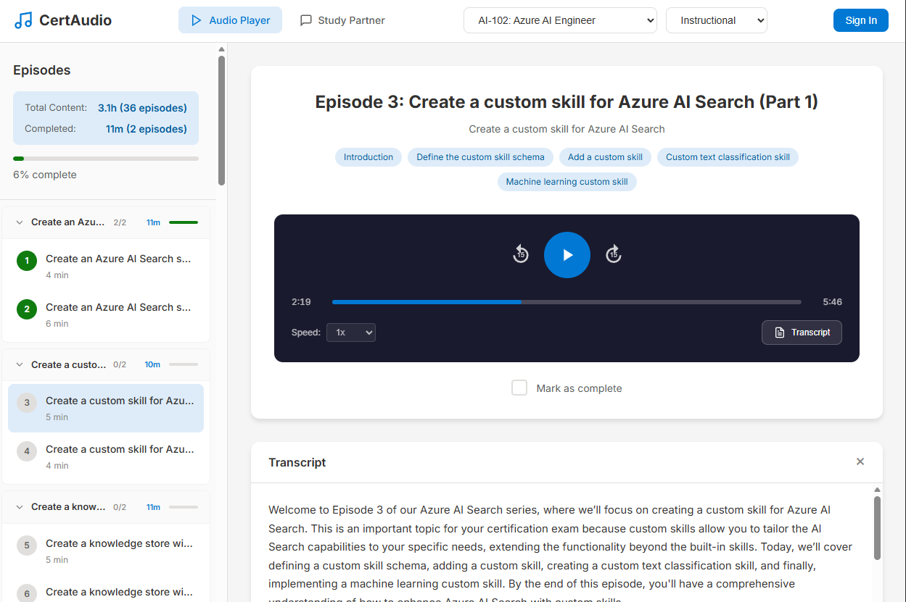
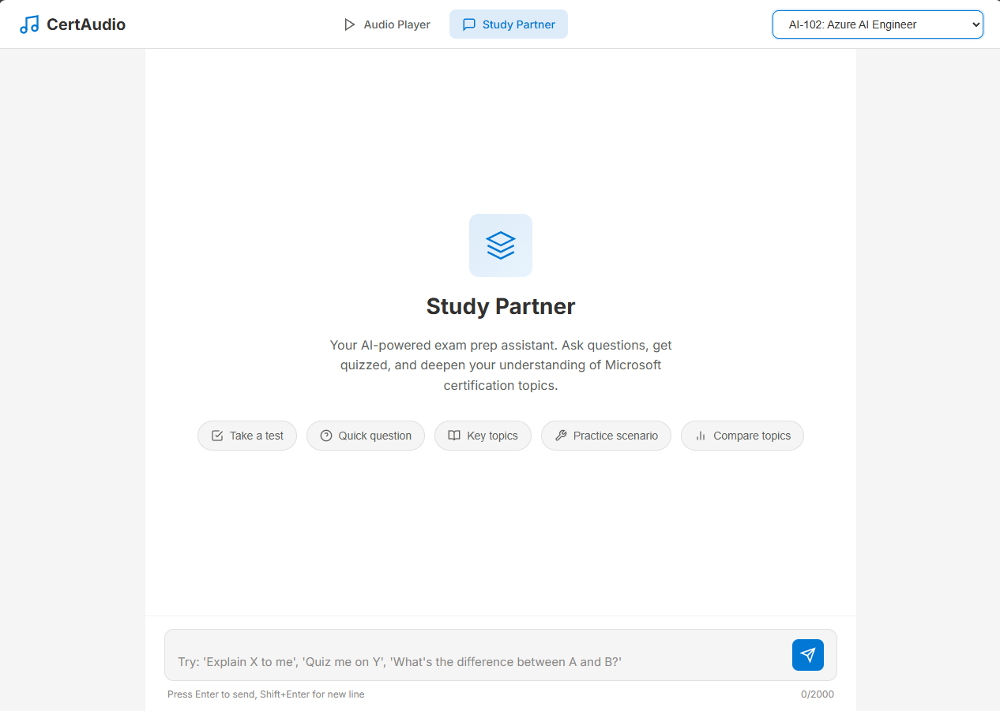
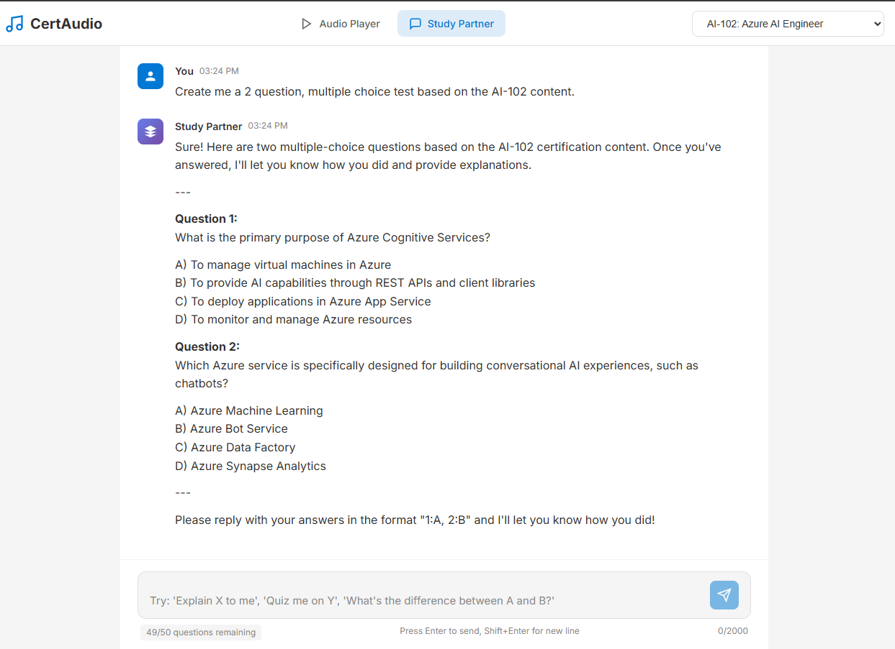
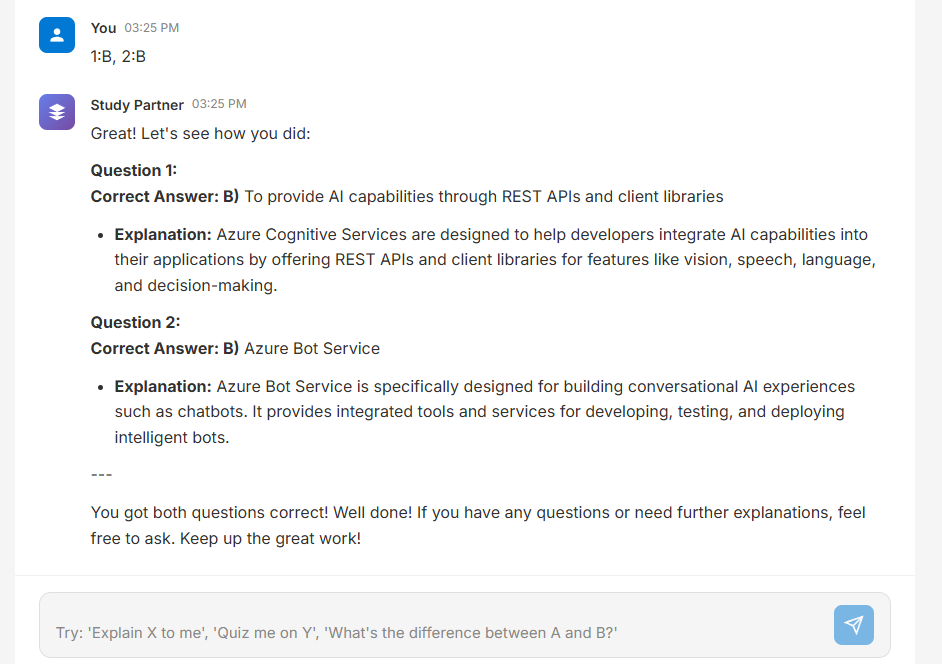
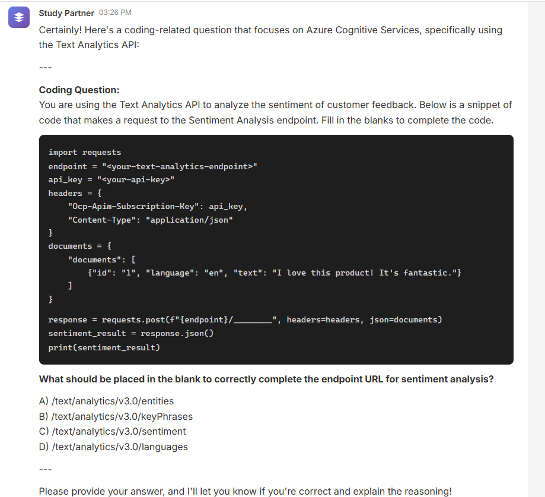
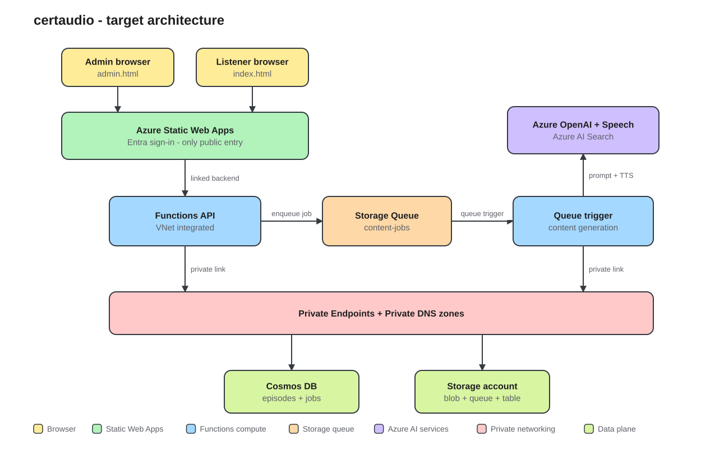

# CertAudio

Turn Microsoft Learn documentation into audio courses for **50+ Microsoft
certification exams**. Deploys into your own Azure subscription with one command,
then generates and refreshes its own content from an admin portal.

- 🎧 Episodes generated from official Microsoft Learn content
- 🎙️ Instructional (single voice) or podcast (two-voice dialogue) formats
- 🔄 Selective refresh when Microsoft updates exam content
- 📊 Progress tracking behind Microsoft Entra sign-in
- 🤖 Optional AI Study Partner grounded on the same indexed content
- 🚀 `azd up` deployment — no fork, no CI/CD, no secrets to configure




<details>
<summary>More screenshots</summary>





</details>

<details>
<summary><strong>Supported certifications</strong> (any current Microsoft exam)</summary>

Certifications are resolved from the Microsoft Learn catalog at index time, so
any current exam code works by typing it into the admin portal — the list below
is a sample, not a whitelist. An ID that is not a real exam is rejected before
any crawling starts.

### Azure
| Exam | Certification |
|------|---------------|
| AZ-900 | Azure Fundamentals |
| AZ-104 | Azure Administrator Associate |
| AZ-204 | Azure Developer Associate |
| AZ-305 | Azure Solutions Architect Expert |
| AZ-400 | DevOps Engineer Expert |
| AZ-500 | Azure Security Engineer Associate |
| AZ-700 | Azure Network Engineer Associate |
| AZ-140 | Azure Virtual Desktop Specialty |
| AZ-800/801 | Windows Server Hybrid Administrator |

### AI & Data
| Exam | Certification |
|------|---------------|
| AI-900 | Azure AI Fundamentals |
| AI-102 | Azure AI Engineer Associate |
| DP-900 | Azure Data Fundamentals |
| DP-100 | Azure Data Scientist Associate |
| DP-203 | Azure Data Engineer Associate |
| DP-300 | Azure Database Administrator Associate |
| DP-600 | Microsoft Fabric Analytics Engineer |
| DP-700 | Microsoft Fabric Data Engineer |

### Security, Compliance & Identity
| Exam | Certification |
|------|---------------|
| SC-900 | Security, Compliance, Identity Fundamentals |
| SC-100 | Cybersecurity Architect Expert |
| SC-200 | Security Operations Analyst Associate |
| SC-300 | Identity and Access Administrator Associate |
| SC-400 | Information Protection Administrator |

### Microsoft 365
| Exam | Certification |
|------|---------------|
| MS-900 | Microsoft 365 Fundamentals |
| MS-102 | Microsoft 365 Administrator |
| MS-700 | Microsoft Teams Administrator |
| MD-102 | Endpoint Administrator |

### Power Platform
| Exam | Certification |
|------|---------------|
| PL-900 | Power Platform Fundamentals |
| PL-100 | Power Platform App Maker |
| PL-200 | Power Platform Functional Consultant |
| PL-300 | Power BI Data Analyst Associate |
| PL-400 | Power Platform Developer |
| PL-500 | Power Automate RPA Developer |
| PL-600 | Power Platform Solution Architect Expert |

### Dynamics 365
| Exam | Certification |
|------|---------------|
| MB-910 | Dynamics 365 Fundamentals (CRM) |
| MB-920 | Dynamics 365 Fundamentals (ERP) |
| MB-210 | Dynamics 365 Sales Functional Consultant |
| MB-220 | Dynamics 365 Customer Insights - Journeys |
| MB-230 | Dynamics 365 Customer Service |
| MB-240 | Dynamics 365 Field Service |
| MB-260 | Dynamics 365 Customer Insights - Data |
| MB-300 | Dynamics 365 Core Finance and Operations |
| MB-310 | Dynamics 365 Finance Functional Consultant |
| MB-330 | Dynamics 365 Supply Chain Management |
| MB-335 | Dynamics 365 Supply Chain Management Expert |
| MB-500 | Dynamics 365 Finance & Operations Developer |
| MB-700 | Dynamics 365 Finance & Operations Solution Architect |
| MB-800 | Dynamics 365 Business Central Functional Consultant |
| MB-820 | Dynamics 365 Business Central Developer |

</details>

## Architecture



Static Web Apps handles sign-in and is the only public entry point. It forwards
authenticated requests to a single Function App as a linked backend, so calling
the Function hostname directly returns `401`. That same Function App also runs
content generation in-process off the `content-jobs` queue, triggered from the
admin portal — it is already VNet integrated, so jobs reach Cosmos DB and Storage
over Private Endpoints and no credential ever leaves Azure.

Private networking is not optional: tenant Azure Policy forces
`publicNetworkAccess=Disabled` and disables shared-key access, so anything
touching the data plane has to run inside the VNet.

[How It Works](docs/HOW_IT_WORKS.md) covers the design decisions, job lifecycle,
security model, and troubleshooting in depth.

## Deploy

You need an Azure subscription with permission to create resources and assign
roles, plus the [Azure Developer CLI](https://aka.ms/azd) and
[Azure CLI](https://learn.microsoft.com/cli/azure/install-azure-cli).

```bash
curl -fsSL https://aka.ms/install-azd.sh | bash

az login
azd config set auth.useAzCliAuth true   # reuse the az login, no second sign-in

git clone https://github.com/matthansen0/certaudio.git
cd certaudio
azd up
```

`azd` prompts for an environment name, subscription, and region, then provisions
everything and deploys both the API and the site. Expect roughly 15 minutes on a
first run, most of it Azure OpenAI and AI Search.

Optional settings, applied before `azd up`:

```bash
azd env set ENABLE_STUDY_PARTNER true      # AI Foundry chat agent, billed per chat token
azd env set AZURE_OPENAI_LOCATION eastus   # GPT-4o has limited regional availability
azd env set AZURE_UNIQUE_SUFFIX 001        # pin names to adopt an existing deployment
```

### Claim admin access

Provisioning writes a one-time `ADMIN_BOOTSTRAP_TOKEN` app setting. Read it:

```bash
az functionapp config appsettings list \
  -g rg-certaudio-<env> -n <function-app-name> \
  --query "[?name=='ADMIN_BOOTSTRAP_TOKEN'].value | [0]" -o tsv
```

Sign in to `https://<your-swa>.azurestaticapps.net/admin.html` and paste the
token. That registers you as the first admin; the token cannot be claimed twice
and rotates on every deployment. From then on you add other admins from the
portal.

## Generate content

Pick a certification and format in the admin portal and press **Start**. The
portal shows live progress and keeps a history of past runs. Submit a **refresh**
job later to re-index only the sources Microsoft has changed and regenerate just
the affected episodes.

Jobs run inside the Function App on the existing plan, so a run adds no compute
cost. Only one job runs at a time — a second submission returns `409` while one
is active. A full certification takes a few hours; don't redeploy mid-run.

Indexing is the cheap half: it discovers content, reports the exact episode count
and a cost estimate, and stops. Generation is the half that costs money, so you
see the bill before committing to it.

Discovery resolves the exam against the Microsoft Learn catalog, walks its
learning paths down to unit level, merges in the official skills-measured list,
then checks every exam topic against what it found and grades the coverage. The
result is shown on the course, including any topics it could not find content
for. See
[Content Discovery](docs/CONTENT_DISCOVERY.md) for how that works and
[How It Works](docs/HOW_IT_WORKS.md#customization-guide) for voices, episode
length, and job parameters.

## Cost

List prices, Central US, USD, excluding tax and discounts. Generation runs inside
the Function App, so it adds no separate compute SKU.

| Service | Monthly |
|---------|---------|
| Azure AI Search (Basic) | ~$73.75 |
| Five Private Endpoints | ~$36.50 + data |
| Azure Functions (B1 Linux, also runs generation) | ~$13.15 |
| Azure Static Web Apps (Standard) | $9.00 |
| Four Private DNS zones | $2.00 |
| Azure Cosmos DB (serverless) | ~$1-5 |
| Application Insights | ~$0-5 |
| Azure Storage (Hot LRS) | ~$0.10-0.50 |
| **Base total** | **~$135-145** |

About $134 of that is fixed regardless of use, and AI Search plus the private
endpoints are roughly 80% of it — both structural rather than optional.
Generation is billed per token and per synthesized character, landing around
**$0.25 per episode**, so a whole certification runs from a few dollars to a few
tens of dollars per format. Subscription-level Microsoft Defender plans are
separate and can exceed service usage; review them with the subscription security
owner. Full breakdown in
[How It Works](docs/HOW_IT_WORKS.md#cost-optimization).

## Study Partner (optional)

An AI chat agent for interactive exam prep, backed by Azure AI Foundry and a
GPT-4o agent with a search tool over the indexed exam content. It is off by
default:

```bash
azd env set ENABLE_STUDY_PARTNER true
azd provision
```

It adds no fixed monthly charge — the deployment is billed per token, roughly
**$0.005-$0.03 per message**. AI Search is not part of this toggle; generation
needs it regardless, so it sits in the base table above.

## Local development

Reopen the repository in its dev container for Python 3.11, Node 22, Azure
Functions Core Tools, SWA CLI, Azurite, Bicep, and the pinned dev dependencies.

```bash
cd src/functions
python -m pytest -q
```

Content generation cannot run from a laptop — Cosmos DB, Storage, and AI Search
are reachable only from inside the VNet — so use the admin portal instead.
`/admin.html` needs the Static Web Apps auth headers, so it only works against a
deployed environment or the SWA CLI emulator.

## Documentation

- [How It Works](docs/HOW_IT_WORKS.md) — architecture, security, deployment, customization, troubleshooting
- [Content Discovery](docs/CONTENT_DISCOVERY.md) — how a certification resolves to content, and how coverage is graded

## Contributing

Fork, branch, and open a pull request.

## License

MIT License - see [LICENSE](LICENSE) for details.

## Disclaimer

This project is not affiliated with or endorsed by Microsoft. The generated audio content is based on publicly available Microsoft Learn documentation. Always verify information against official Microsoft documentation before taking certification exams.
