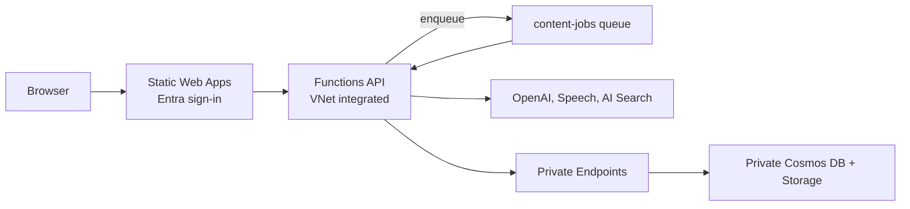

# CertAudio - Microsoft Certification Audio Learning Platform

A fully automated Azure-native system that generates podcast-style or instructional audio content from Microsoft Learn documentation for **all 50+ Microsoft certification exams**.

## Features

- 🎧 **Auto-generated audio episodes** from official Microsoft Learn documentation
- 📚 **All Microsoft certifications** - Azure, AI, Data, Security, M365, Power Platform, Dynamics 365
- 🎙️ **Two formats**: Instructional (single authoritative voice) or Podcast (two-voice dialogue)
- 🔄 **Selective episode refresh** when Microsoft updates exam content
- 📊 **Progress tracking** with optional Static Web Apps Microsoft authentication
- 🤖 **AI Study Partner** (optional) - Chat with an AI agent that has RAG access to exam content
- 🚀 **One-click deployment** with Bicep IaC

## Screenshots


## Supported Certifications

### Azure
| Exam | Certification |
|------|---------------|
| AZ-900 | Azure Fundamentals |
| AZ-104 | Azure Administrator Associate |
| AZ-204 | Azure Developer Associate |
| AZ-305 | Azure Solutions Architect Expert |
| AZ-400 | DevOps Engineer Expert |
| AZ-500 | Azure Security Engineer Associate |
| AZ-700 | Azure Network Engineer Associate |
| AZ-140 | Azure Virtual Desktop Specialty |
| AZ-800/801 | Windows Server Hybrid Administrator |

### AI & Data
| Exam | Certification |
|------|---------------|
| AI-900 | Azure AI Fundamentals |
| AI-102 | Azure AI Engineer Associate |
| DP-900 | Azure Data Fundamentals |
| DP-100 | Azure Data Scientist Associate |
| DP-203 | Azure Data Engineer Associate |
| DP-300 | Azure Database Administrator Associate |
| DP-600 | Microsoft Fabric Analytics Engineer |
| DP-700 | Microsoft Fabric Data Engineer |

### Security, Compliance & Identity
| Exam | Certification |
|------|---------------|
| SC-900 | Security, Compliance, Identity Fundamentals |
| SC-100 | Cybersecurity Architect Expert |
| SC-200 | Security Operations Analyst Associate |
| SC-300 | Identity and Access Administrator Associate |
| SC-400 | Information Protection Administrator |

### Microsoft 365
| Exam | Certification |
|------|---------------|
| MS-900 | Microsoft 365 Fundamentals |
| MS-102 | Microsoft 365 Administrator |
| MS-700 | Microsoft Teams Administrator |
| MD-102 | Endpoint Administrator |

### Power Platform
| Exam | Certification |
|------|---------------|
| PL-900 | Power Platform Fundamentals |
| PL-100 | Power Platform App Maker |
| PL-200 | Power Platform Functional Consultant |
| PL-300 | Power BI Data Analyst Associate |
| PL-400 | Power Platform Developer |
| PL-500 | Power Automate RPA Developer |
| PL-600 | Power Platform Solution Architect Expert |

### Dynamics 365
| Exam | Certification |
|------|---------------|
| MB-910 | Dynamics 365 Fundamentals (CRM) |
| MB-920 | Dynamics 365 Fundamentals (ERP) |
| MB-210 | Dynamics 365 Sales Functional Consultant |
| MB-220 | Dynamics 365 Customer Insights - Journeys |
| MB-230 | Dynamics 365 Customer Service |
| MB-240 | Dynamics 365 Field Service |
| MB-260 | Dynamics 365 Customer Insights - Data |
| MB-300 | Dynamics 365 Core Finance and Operations |
| MB-310 | Dynamics 365 Finance Functional Consultant |
| MB-330 | Dynamics 365 Supply Chain Management |
| MB-335 | Dynamics 365 Supply Chain Management Expert |
| MB-500 | Dynamics 365 Finance & Operations Developer |
| MB-700 | Dynamics 365 Finance & Operations Solution Architect |
| MB-800 | Dynamics 365 Business Central Functional Consultant |
| MB-820 | Dynamics 365 Business Central Developer |

## Architecture



Everything runs behind one Function App. Static Web Apps handles sign-in and is the
only public entry point; it forwards authenticated requests to the Function as a
linked backend, so calling the Function hostname directly returns `401`.

Content generation is triggered from the admin portal at `/admin.html`, which
enqueues a job on the `content-jobs` queue. A queue trigger in the same Function
App runs the generation in-process. Because the Function is already VNet
integrated, the job reaches Cosmos DB and Storage over Private Endpoints without
any separate compute, and no credential ever leaves Azure.

Private networking is not optional here — tenant Azure Policy forces
`publicNetworkAccess=Disabled` and disables shared-key access on Storage and
Cosmos DB. Anything that needs the data plane must run inside the VNet.

For the full topology and the job lifecycle, see
[architecture.svg](docs/diagrams/architecture.svg) and
[generation-flow.svg](docs/diagrams/generation-flow.svg).

## Prerequisites

- Azure subscription with permissions to create resources and assign roles
- [Azure Developer CLI](https://aka.ms/azd) and [Azure CLI](https://learn.microsoft.com/cli/azure/install-azure-cli)

## Quick Start

Deployment uses the [Azure Developer CLI](https://aka.ms/azd). There is no CI/CD
to configure: no fork, no app registration, no GitHub secrets, no OIDC. Once
deployed the app generates its own content from the admin portal, so it never
needs the repository again.

### 1. Prerequisites

```bash
# Azure Developer CLI
curl -fsSL https://aka.ms/install-azd.sh | bash

az login
azd config set auth.useAzCliAuth true   # reuse the az login, no second sign-in
```

### 2. Deploy

```bash
git clone https://github.com/matthansen0/certaudio.git
cd certaudio

azd up
```

`azd` prompts for an environment name, subscription, and region, then provisions
everything and deploys both the API and the site. Expect roughly 15 minutes on a
first run, most of it Azure OpenAI and AI Search.

### 3. Claim Admin Access

Provisioning writes a one-time `ADMIN_BOOTSTRAP_TOKEN` app setting. Read it:

```bash
azd env get-values | grep FUNCTIONS_APP_NAME

az functionapp config appsettings list \
  -g rg-certaudio-<env> -n <function-app-name> \
  --query "[?name=='ADMIN_BOOTSTRAP_TOKEN'].value | [0]" -o tsv
```

Sign in to `https://<your-swa>.azurestaticapps.net/admin.html` and paste the
token. That registers you as the first admin; the token cannot be claimed twice
and rotates on every deployment. From then on you add other admins from the
portal itself.

### Optional configuration

Set these before `azd up` to override the defaults:

```bash
azd env set ENABLE_STUDY_PARTNER true      # AI Foundry chat agent, ~$5-10/mo
azd env set AZURE_OPENAI_LOCATION eastus   # GPT-4o has limited regional availability
azd env set AZURE_UNIQUE_SUFFIX 001        # pin resource names to adopt an existing deployment
```

`AZURE_UNIQUE_SUFFIX` is only needed to adopt resources that already exist. Left
unset, names are derived deterministically from your subscription and environment
name, so repeated `azd up` runs are stable.

### 6. Generate Content

Submit a job from the admin portal: pick a certification and format, then press
**Start**. The portal shows live progress and keeps a history of past runs.

Jobs run inside the Function App on the existing B1 plan, so a run adds no
compute cost. Only one job runs at a time — a second submission returns `409`
while one is active. A full certification takes a few hours; the portal warns
you not to redeploy mid-run.

## Configuration

### Parameters

| Parameter | Default | Description |
|-----------|---------|-------------|
| `certificationId` | `ai-102` | Microsoft certification ID (see supported list above) |
| `audioFormat` | `instructional` | `instructional` or `podcast` |
| `instructionalVoice` | `en-US-Andrew:DragonHDLatestNeural` | Voice for instructional format |
| `podcastHostVoice` | `en-US-Ava:DragonHDLatestNeural` | Host voice for podcast format |
| `podcastExpertVoice` | `en-US-Andrew:DragonHDLatestNeural` | Expert voice for podcast format |
| `forceRegenerate` | `false` | Regenerate episodes that already exist |
| `enableStudyPartner` | `false` | Deploy the AI Foundry Study Partner agent |
| `location` | `centralus` | Core Azure region |

## Project Structure

```
├── azure.yaml                 # azd project: services, infra, hooks
├── .github/
│   └── agents.md              # Copilot agent definitions
├── infra/
│   ├── main.bicep             # Subscription-scoped entry point
│   ├── main.parameters.json   # azd parameter bindings
│   └── modules/               # Bicep modules (incl. rbac.bicep)
├── scripts/
│   └── postprovision.sh       # SWA backend link + EasyAuth enforcement
├── src/
│   ├── functions/             # Azure Functions API
│   │   ├── function_app.py    # Player and progress API
│   │   ├── admin.py           # Admin API + content-jobs queue worker
│   │   ├── admin_store.py     # Cosmos access for admins and jobs
│   │   └── pipeline/          # Content generation, run in-process
│   └── web/                   # Static Web App frontend (incl. admin.html)
└── README.md
```

## Audio Generation

### Discovery Strategy (Combined)

Content generation always uses the **combined** strategy: Microsoft Learn learning paths **plus** the exam study guide skills outline for full official coverage.

**Key features**:
- **Dynamic learning path resolution** — discovers paths by role + product tags instead of hardcoded UIDs (resilient to Microsoft restructuring)
- **Coverage sweep** — checks every exam topic against discovered content with fallback chain (catalog → search API → explicit gap)
- **Confidence score** — outputs a weighted coverage percentage (Grade A–F) so you know how complete the content is

See [docs/CONTENT_DISCOVERY.md](docs/CONTENT_DISCOVERY.md) for details.

### Instructional Format

- Single voice: Configurable (default `en-US-AndrewNeural`)
- Research-backed prosody: -8% rate, 500ms pauses after key concepts
- ~20-25 minute episodes targeting 2,500-3,500 words

### Podcast Format

- Two voices for natural dialogue:
  - Host: Configurable (default `en-US-GuyNeural`) - newscast style, conversational
  - Expert: Configurable (default `en-US-TonyNeural`) - expressive, detailed
- Back-and-forth Q&A style

### Voice Options

Available voices: `en-US-AndrewNeural`, `en-US-BrianNeural`, `en-US-GuyNeural`, `en-US-DavisNeural`, `en-US-JasonNeural`, `en-US-TonyNeural`, `en-US-AvaNeural`, `en-US-EmmaNeural`, `en-US-JennyNeural`, `en-US-AriaNeural`, `en-US-SaraNeural`

## Content Updates

Submit a **refresh** job from the admin portal to pick up upstream changes. It:

1. Checks Microsoft Learn pages for content changes
2. Compares content hashes against stored versions
3. Re-indexes changed sources into the shared search index
4. Regenerates only the episode batches affected by changed sources
5. Republishes the validated episode index

## Local Development

### Development Environment

Reopen the repository in its dev container to get Python 3.11, Node 22, Azure Functions Core Tools, SWA CLI, Azurite, Bicep, and the exact development dependency lock. The bootstrap recreates a mismatched virtual environment automatically.

Cosmos DB, Storage, and AI Search are private and reachable only from inside the
VNet, so content generation cannot run from a laptop. Run it from the admin
portal instead. Locally you get unit tests and emulators:

```bash
# Unit tests for the Functions API, auth, and admin authorization
cd src/functions
python -m pytest -q
```

### Run the Web App

```bash
cd src/web
python -m http.server 8080
# Open http://localhost:8080
```

Note that `/admin.html` needs the Static Web Apps auth headers, so it only works
against a deployed environment or the SWA CLI emulator.

## Study Partner (Optional)

The **Study Partner** feature adds an AI-powered chat interface for interactive exam preparation. When enabled, it deploys:

- **Azure AI Foundry** - Account with project for agent orchestration
- **GPT-4o Agent** - Conversational AI with a search tool over indexed exam content

AI Search is *not* part of this toggle. It is always deployed because content
generation grounds on the same `certification-content` index the agent queries.

### Enabling Study Partner

```bash
azd env set ENABLE_STUDY_PARTNER true
azd provision
```


### Study Partner Architecture

```
┌──────────────────┐     ┌─────────────────────────────────────────────┐
│   Web Frontend   │────►│              Azure Functions                │
│  (Study Partner  │     │  /api/chat → AI Foundry Agent SDK           │
│      Tab)        │     └──────────────────┬──────────────────────────┘
└──────────────────┘                        │
                                            ▼
                              ┌─────────────────────────────┐
                              │     Azure AI Foundry        │
                              │  ┌───────────────────────┐  │
                              │  │   Study Partner       │  │
                              │  │      Project          │  │
                              │  │  ┌─────────────────┐  │  │
                              │  │  │   GPT-4o Agent  │  │  │
                              │  │  │  + Search Tool  │──┼──┼──► AI Search
                              │  │  └─────────────────┘  │  │   (RAG Index)
                              │  └───────────────────────┘  │
                              └─────────────────────────────┘
```

### Additional Cost (when enabled)

| Service | Estimated Cost |
|---------|---------------|
| Azure AI Foundry | ~$5-10/month (usage-based) |
| **Study Partner Add-on** | **~$5-10/month** |

> **Note**: The agent is disabled by default. The AI Search cost is already in
> the base platform table above, because generation needs it regardless.

---

## Cost Estimation

Approximate platform costs vary by region and tenant policy. The private topology adds five Private Endpoints (roughly `$36.50/month` at `$0.01/hour` each, plus data processing). Content generation runs inside the Function App, so it adds no separate compute SKU.

| Service | Estimated Cost |
|---------|---------------|
| Azure Static Web Apps (Standard) | $9 |
| Azure Functions (B1 Basic, also runs generation) | $13 |
| Azure AI Search (Basic) | ~$75 |
| Azure Cosmos DB (Serverless) | $2-5 |
| Azure Storage | $0.10 |
| Five Private Endpoints | ~$36.50 + data |

AI Search is always deployed. It holds the single `certification-content` index
that serves both generation grounding and Study Partner retrieval, so the cost
is shared rather than duplicated per certification.

Microsoft Defender plans are subscription-policy costs and can materially exceed service usage. Review them with the subscription security owner rather than disabling them as an application deployment side effect.

**Per-Generation Cost** (one certification):

| Service | Cost |
|---------|------|
| Azure OpenAI (GPT-4o) | ~$15-25 |
| Azure OpenAI (Embeddings) | ~$0.25 |
| Azure AI Speech (TTS) | ~$15-20 |
| **Per-Generation Total** | **~$30-45** |

## Contributing

1. Fork the repository
2. Create a feature branch
3. Make your changes
4. Submit a pull request

## License

MIT License - see [LICENSE](LICENSE) for details.

## Disclaimer

This project is not affiliated with or endorsed by Microsoft. The generated audio content is based on publicly available Microsoft Learn documentation. Always verify information against official Microsoft documentation before taking certification exams.
