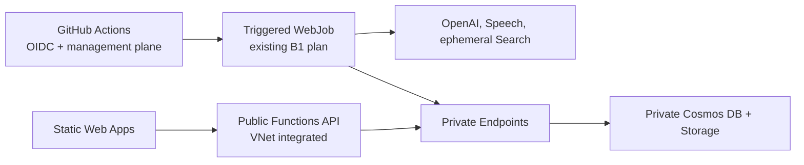

# CertAudio - Microsoft Certification Audio Learning Platform

A fully automated Azure-native system that generates podcast-style or instructional audio content from Microsoft Learn documentation for **all 50+ Microsoft certification exams**.

## Features

- 🎧 **Auto-generated audio episodes** from official Microsoft Learn documentation
- 📚 **All Microsoft certifications** - Azure, AI, Data, Security, M365, Power Platform, Dynamics 365
- 🎙️ **Two formats**: Instructional (single authoritative voice) or Podcast (two-voice dialogue)
- 🔄 **Selective episode refresh** when Microsoft updates exam content
- 📊 **Progress tracking** with optional Static Web Apps Microsoft authentication
- 🤖 **AI Study Partner** (optional) - Chat with an AI agent that has RAG access to exam content
- 🚀 **One-click deployment** with Bicep IaC

## Screenshots


## Supported Certifications

### Azure
| Exam | Certification |
|------|---------------|
| AZ-900 | Azure Fundamentals |
| AZ-104 | Azure Administrator Associate |
| AZ-204 | Azure Developer Associate |
| AZ-305 | Azure Solutions Architect Expert |
| AZ-400 | DevOps Engineer Expert |
| AZ-500 | Azure Security Engineer Associate |
| AZ-700 | Azure Network Engineer Associate |
| AZ-140 | Azure Virtual Desktop Specialty |
| AZ-800/801 | Windows Server Hybrid Administrator |

### AI & Data
| Exam | Certification |
|------|---------------|
| AI-900 | Azure AI Fundamentals |
| AI-102 | Azure AI Engineer Associate |
| DP-900 | Azure Data Fundamentals |
| DP-100 | Azure Data Scientist Associate |
| DP-203 | Azure Data Engineer Associate |
| DP-300 | Azure Database Administrator Associate |
| DP-600 | Microsoft Fabric Analytics Engineer |
| DP-700 | Microsoft Fabric Data Engineer |

### Security, Compliance & Identity
| Exam | Certification |
|------|---------------|
| SC-900 | Security, Compliance, Identity Fundamentals |
| SC-100 | Cybersecurity Architect Expert |
| SC-200 | Security Operations Analyst Associate |
| SC-300 | Identity and Access Administrator Associate |
| SC-400 | Information Protection Administrator |

### Microsoft 365
| Exam | Certification |
|------|---------------|
| MS-900 | Microsoft 365 Fundamentals |
| MS-102 | Microsoft 365 Administrator |
| MS-700 | Microsoft Teams Administrator |
| MD-102 | Endpoint Administrator |

### Power Platform
| Exam | Certification |
|------|---------------|
| PL-900 | Power Platform Fundamentals |
| PL-100 | Power Platform App Maker |
| PL-200 | Power Platform Functional Consultant |
| PL-300 | Power BI Data Analyst Associate |
| PL-400 | Power Platform Developer |
| PL-500 | Power Automate RPA Developer |
| PL-600 | Power Platform Solution Architect Expert |

### Dynamics 365
| Exam | Certification |
|------|---------------|
| MB-910 | Dynamics 365 Fundamentals (CRM) |
| MB-920 | Dynamics 365 Fundamentals (ERP) |
| MB-210 | Dynamics 365 Sales Functional Consultant |
| MB-220 | Dynamics 365 Customer Insights - Journeys |
| MB-230 | Dynamics 365 Customer Service |
| MB-240 | Dynamics 365 Field Service |
| MB-260 | Dynamics 365 Customer Insights - Data |
| MB-300 | Dynamics 365 Core Finance and Operations |
| MB-310 | Dynamics 365 Finance Functional Consultant |
| MB-330 | Dynamics 365 Supply Chain Management |
| MB-335 | Dynamics 365 Supply Chain Management Expert |
| MB-500 | Dynamics 365 Finance & Operations Developer |
| MB-700 | Dynamics 365 Finance & Operations Solution Architect |
| MB-800 | Dynamics 365 Business Central Functional Consultant |
| MB-820 | Dynamics 365 Business Central Developer |

## Architecture



GitHub-hosted runners package and trigger the WebJob through Azure management endpoints, but they never access the private data plane. The Function remains public for the Static Web Apps linked backend; its Cosmos DB, data Blob, and host Blob/Queue/Table traffic resolves through five Private Endpoints. The job shares the Central US VNet through the App Service integration subnet.

## Prerequisites

- Azure subscription with permissions to create resources
- GitHub repository with Actions enabled
- Azure CLI installed locally (for initial setup)

## Quick Start

### 1. Fork and Clone

```bash
git clone https://github.com/YOUR_USERNAME/certaudio.git
cd certaudio
```

### 2. Create Azure Resources and Configure OIDC

GitHub Actions uses **OpenID Connect (OIDC)** for secure, keyless authentication to Azure. This is more secure than storing credentials as secrets.

```bash
# Login to Azure
az login

# Set your subscription
SUBSCRIPTION_ID=$(az account show --query id -o tsv)
TENANT_ID=$(az account show --query tenantId -o tsv)

# Create resource group
az group create --name rg-certaudio-dev --location centralus

# Create an App Registration for GitHub Actions
APP_NAME="sp-certaudio-github-$(whoami)"
APP_ID=$(az ad app create --display-name "$APP_NAME" --query appId -o tsv)
echo "App (Client) ID: $APP_ID"

# Create service principal and assign Contributor role
SP_ID=$(az ad sp create --id "$APP_ID" --query id -o tsv)
az role assignment create \
  --assignee "$APP_ID" \
  --role "Contributor" \
  --scope "/subscriptions/$SUBSCRIPTION_ID/resourceGroups/rg-certaudio-dev"

# Add federated credential for GitHub Actions OIDC
# Replace YOUR_GITHUB_USERNAME with your GitHub username or org
GITHUB_REPO="YOUR_GITHUB_USERNAME/certaudio"
az ad app federated-credential create \
  --id "$APP_ID" \
  --parameters '{
    "name": "github-actions-main",
    "issuer": "https://token.actions.githubusercontent.com",
    "subject": "repo:'"$GITHUB_REPO"':ref:refs/heads/main",
    "audiences": ["api://AzureADTokenExchange"]
  }'

# Also allow workflow_dispatch (manual triggers)
az ad app federated-credential create \
  --id "$APP_ID" \
  --parameters '{
    "name": "github-actions-workflow-dispatch",
    "issuer": "https://token.actions.githubusercontent.com", 
    "subject": "repo:'"$GITHUB_REPO"':environment:production",
    "audiences": ["api://AzureADTokenExchange"]
  }'

echo ""
echo "=== Add these as GitHub Secrets ==="
echo "AZURE_CLIENT_ID: $APP_ID"
echo "AZURE_TENANT_ID: $TENANT_ID"
echo "AZURE_SUBSCRIPTION_ID: $SUBSCRIPTION_ID"
echo "AZURE_RESOURCE_GROUP: rg-certaudio-dev"
echo "AZURE_UNIQUE_SUFFIX: (optional) e.g., 001 - pins deployments to stable resource names"
```

### 3. Configure GitHub Secrets

Go to your repository **Settings > Secrets and variables > Actions** and add:

| Secret | Description | Example |
|--------|-------------|---------|
| `AZURE_CLIENT_ID` | App registration client ID | `12345678-1234-...` |
| `AZURE_TENANT_ID` | Azure AD tenant ID | `87654321-4321-...` |
| `AZURE_SUBSCRIPTION_ID` | Azure subscription ID | `abcdef12-...` |
| `AZURE_RESOURCE_GROUP` | Resource group name | `rg-certaudio-dev` |
| `AZURE_UNIQUE_SUFFIX` | (Optional) Pin resource names | `001` |

> **Note:** `AZURE_UNIQUE_SUFFIX` is recommended to prevent creating new resources on every workflow run. Without it, each run creates a full new set of resources.

### 4. Deploy Infrastructure

Run the **Deploy Infrastructure** workflow from GitHub Actions, or:

```bash
az deployment group create \
  --resource-group rg-certaudio-dev \
  --template-file infra/main.bicep \
  --parameters uniqueSuffix=001 enableStudyPartner=false
```

### 5. Generate Content

Run the **Generate Content** workflow to deploy and trigger the Python WebJob hosted on the existing Central US B1 plan. The workflow deletes ephemeral AI Search when execution finishes.

## Configuration

### Parameters

| Parameter | Default | Description |
|-----------|---------|-------------|
| `certificationId` | `ai-102` | Microsoft certification ID (see supported list above) |
| `audioFormat` | `instructional` | `instructional` or `podcast` |
| `instructionalVoice` | `en-US-Andrew:DragonHDLatestNeural` | Voice for instructional format |
| `podcastHostVoice` | `en-US-Ava:DragonHDLatestNeural` | Host voice for podcast format |
| `podcastExpertVoice` | `en-US-Andrew:DragonHDLatestNeural` | Expert voice for podcast format |
| `forceRegenerate` | `false` | Regenerate episodes that already exist |
| `enableStudyPartner` | `false` | Deploy persistent Search and AI Foundry Study Partner resources |
| `location` | `centralus` | Core Azure region |

## Project Structure

```
├── .github/
│   ├── agents.md              # Copilot agent definitions
│   └── workflows/
│       ├── deploy-infra.yml   # Infrastructure deployment
│       ├── generate-content.yml # Content generation
│       └── refresh-content.yml  # Content refresh
├── infra/
│   ├── main.bicep             # Main orchestrator
│   └── modules/               # Bicep modules
├── src/
│   ├── functions/             # Azure Functions API
│   ├── pipeline/              # Content generation tools
│   └── web/                   # Static Web App frontend
└── README.md
```

## Audio Generation

### Discovery Strategy (Combined)

Content generation always uses the **combined** strategy: Microsoft Learn learning paths **plus** the exam study guide skills outline for full official coverage.

**Key features**:
- **Dynamic learning path resolution** — discovers paths by role + product tags instead of hardcoded UIDs (resilient to Microsoft restructuring)
- **Coverage sweep** — checks every exam topic against discovered content with fallback chain (catalog → search API → explicit gap)
- **Confidence score** — outputs a weighted coverage percentage (Grade A–F) so you know how complete the content is

See [docs/CONTENT_DISCOVERY.md](docs/CONTENT_DISCOVERY.md) for details.

### Instructional Format

- Single voice: Configurable (default `en-US-AndrewNeural`)
- Research-backed prosody: -8% rate, 500ms pauses after key concepts
- ~20-25 minute episodes targeting 2,500-3,500 words

### Podcast Format

- Two voices for natural dialogue:
  - Host: Configurable (default `en-US-GuyNeural`) - newscast style, conversational
  - Expert: Configurable (default `en-US-TonyNeural`) - expressive, detailed
- Back-and-forth Q&A style

### Voice Options

Available voices: `en-US-AndrewNeural`, `en-US-BrianNeural`, `en-US-GuyNeural`, `en-US-DavisNeural`, `en-US-JasonNeural`, `en-US-TonyNeural`, `en-US-AvaNeural`, `en-US-EmmaNeural`, `en-US-JennyNeural`, `en-US-AriaNeural`, `en-US-SaraNeural`

## Content Updates

The **Refresh Content** workflow runs weekly to:

1. Check Microsoft Learn pages for content changes
2. Compare content hashes against stored versions
3. Rebuild the temporary RAG index when updates exist
4. Regenerate only the episode batches affected by changed sources
5. Republish the validated episode index

## Local Development

### Development Environment

Reopen the repository in its dev container to get Python 3.11, Node 22, Azure Functions Core Tools, SWA CLI, Azurite, Bicep, and the exact development dependency lock. The bootstrap recreates a mismatched virtual environment automatically.

The deployed Cosmos DB and Storage accounts are private. Full generation therefore runs in the **Generate Content** workflow's VNet-integrated job. The local runner requires private network connectivity to that VNet; without it, use local unit tests and emulators instead of changing the Azure firewalls.

```bash
# Make sure you're logged in to Azure
az login

# Run only when this machine has private VNet connectivity
./scripts/run-local.sh dp-700                           # Defaults: instructional
./scripts/run-local.sh az-104 podcast                   # Podcast format

# Force regenerate existing episodes
FORCE_REGENERATE=true ./scripts/run-local.sh dp-700
```

The local runner, when connected to the VNet:
1. Resolves service endpoints from Azure (OpenAI, Speech, Cosmos, Storage)
2. Creates an ephemeral AI Search service for indexing
3. Runs the full pipeline: discover → index → generate
4. Cleans up the Search service when done

### Index Content for Study Partner (No Audio)

To populate the Study Partner's search index without generating audio (saves TTS tokens):

```bash
# Index a single certification into the shared Study Partner index
./scripts/index-content.sh dp-700 certification-content
./scripts/index-content.sh ai-102 certification-content
./scripts/index-content.sh ab-731 certification-content

# Index into a per-cert index (for later audio generation)
./scripts/index-content.sh dp-700
```

This script runs discovery and indexing only - no TTS or audio generation.

### Run the Web App

```bash
cd src/web
python -m http.server 8080
# Open http://localhost:8080
```

### Run Individual Pipeline Tools

```bash
cd src/pipeline
pip install -r requirements.txt
python -m tools.discover_exam_content --certification-id ai-102
```

## Study Partner (Optional)

The **Study Partner** feature adds an AI-powered chat interface for interactive exam preparation. When enabled, it deploys:

- **Azure AI Foundry** - Account with project for agent orchestration
- **Azure AI Search** (Basic tier) - Persistent vector store for RAG
- **GPT-4o Agent** - Conversational AI with access to indexed exam content

### Enabling Study Partner

1. **Via GitHub Actions** (recommended):
   - Go to Actions → Deploy Infrastructure
   - Click "Run workflow"
   - Check "Enable Study Partner" checkbox
   - Click "Run workflow"

2. **Via Azure CLI**:
   ```bash
   az deployment group create \
     --resource-group rg-certaudio-dev \
     --template-file infra/main.bicep \
     --parameters enableStudyPartner=true
   ```

### Study Partner Architecture

```
┌──────────────────┐     ┌─────────────────────────────────────────────┐
│   Web Frontend   │────►│              Azure Functions                │
│  (Study Partner  │     │  /api/chat → AI Foundry Agent SDK           │
│      Tab)        │     └──────────────────┬──────────────────────────┘
└──────────────────┘                        │
                                            ▼
                              ┌─────────────────────────────┐
                              │     Azure AI Foundry        │
                              │  ┌───────────────────────┐  │
                              │  │   Study Partner       │  │
                              │  │      Project          │  │
                              │  │  ┌─────────────────┐  │  │
                              │  │  │   GPT-4o Agent  │  │  │
                              │  │  │  + Search Tool  │──┼──┼──► AI Search
                              │  │  └─────────────────┘  │  │   (RAG Index)
                              │  └───────────────────────┘  │
                              └─────────────────────────────┘
```

### Additional Cost (when enabled)

| Service | Estimated Cost |
|---------|---------------|
| Azure AI Search (Basic) | ~$75/month |
| Azure AI Foundry | ~$5-10/month (usage-based) |
| **Study Partner Add-on** | **~$80-85/month** |

> **Note**: Study Partner is disabled by default due to the additional monthly cost.

---

## Cost Estimation

Approximate platform costs vary by region and tenant policy. The private topology adds five Private Endpoints (roughly `$36.50/month` at `$0.01/hour` each, plus data processing). The triggered WebJob shares the existing B1 plan and adds no separate compute SKU; the existing Basic ACR remains always on but is no longer required by the pipeline runtime.

| Service | Estimated Cost |
|---------|---------------|
| Azure Static Web Apps (Standard) | $9 |
| Azure Functions (B1 Basic) | $13 |
| Azure Cosmos DB (Serverless) | $2-5 |
| Azure Storage | $0.10 |
| Azure Container Registry (Basic) | ~$5 |
| Five Private Endpoints | ~$36.50 + data |
| Triggered pipeline WebJob | Included in existing B1 plan |
| Persistent AI Search (when deployed) | ~$75 |

Microsoft Defender plans are subscription-policy costs and can materially exceed service usage. Review them with the subscription security owner rather than disabling them as an application deployment side effect.

**Per-Generation Cost** (one certification):

| Service | Cost |
|---------|------|
| Azure AI Search (ephemeral, 2-4 hours) | ~$0.50 |
| Azure OpenAI (GPT-4o) | ~$15-25 |
| Azure OpenAI (Embeddings) | ~$0.25 |
| Azure AI Speech (TTS) | ~$15-20 |
| **Per-Generation Total** | **~$30-50** |

## Contributing

1. Fork the repository
2. Create a feature branch
3. Make your changes
4. Submit a pull request

## License

MIT License - see [LICENSE](LICENSE) for details.

## Disclaimer

This project is not affiliated with or endorsed by Microsoft. The generated audio content is based on publicly available Microsoft Learn documentation. Always verify information against official Microsoft documentation before taking certification exams.
