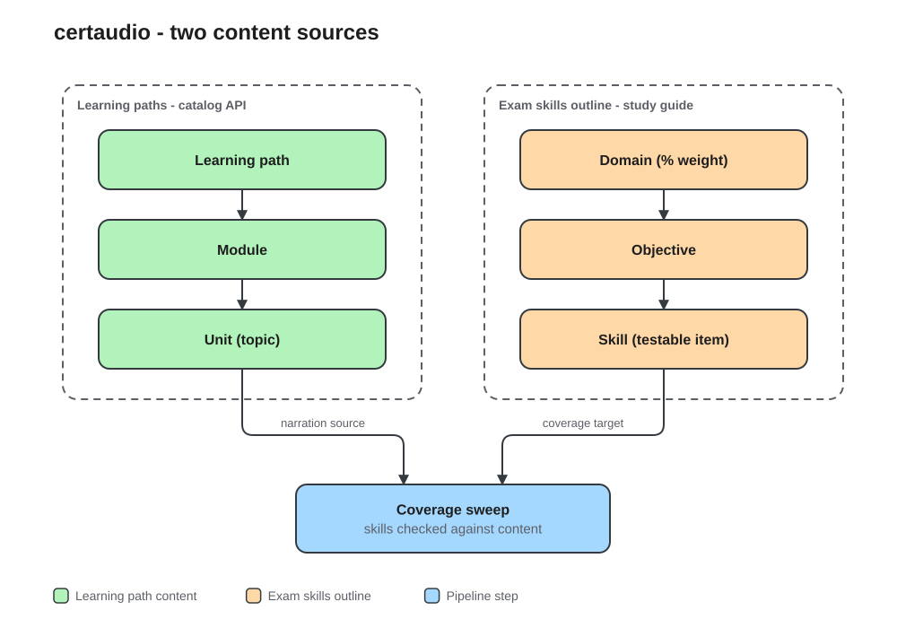

# Content Discovery Logic

This document explains how CertAudio discovers and organizes content for Microsoft certification exams.

## Two Content Sources

Microsoft describes a certification in two different structures, and CertAudio uses
both. Neither alone is sufficient.



### 1. Learning Paths (Educational Content)

**Source**: Microsoft Learn Catalog API (`https://learn.microsoft.com/api/catalog/`)

**Purpose**: Teaches concepts and foundational knowledge.

**Example (DP-700)**:
- "Use Apache Spark in Microsoft Fabric" (module)
  - "Introduction to Apache Spark" (unit)
  - "Run Spark code in notebooks" (unit)
  - "Work with data in Spark" (unit)

**Characteristics**:
- Conceptual, educational tone
- Includes intro/summary/exercise units
- Same module can appear in multiple learning paths (deduplication needed)
- ~22 unique modules for DP-700

### 2. Exam Skills Outline (Testable Skills)

**Source**: the `skills` array on the certification's Learn catalog record,
merged with the exam study guide page (e.g. `https://aka.ms/DP700-StudyGuide`)

**Purpose**: Defines exactly what Microsoft will test on the exam.

**Example (DP-700)**:
- "Monitor and optimize an analytics solution (30-35%)" (domain)
  - "Optimize performance" (objective)
    - "Optimize Spark performance" (skill)
    - "Optimize query performance" (skill)
    - "Optimize eventstreams and eventhouses" (skill)

**Characteristics**:
- Action-oriented, specific
- Maps directly to exam questions
- Some skills have NO dedicated learning path content
- 55 specific skills for DP-700

## The Gap: Why Both Are Needed

Learning paths and exam skills are **complementary, not overlapping**:

| Learning Path Unit | Exam Skill |
|-------------------|------------|
| "Use Apache Spark in Microsoft Fabric" | "Optimize Spark performance" |
| "Work with Delta Lake tables" | "Optimize a lakehouse table" |
| "Introduction to eventstreams" | "Process data by using eventstreams" |

The learning path teaches **"what is this thing"** while the exam skill requires **"how do I do this specific action"**.

### Skills Without Learning Path Coverage

Some exam skills don't have dedicated learning path content:

- ❌ "Implement database projects"
- ❌ "Implement dynamic data masking"
- ❌ "Apply sensitivity labels to items"
- ❌ "Endorse items"
- ❌ "Implement mirroring"
- ❌ "Handle duplicate, missing, and late-arriving data"
- ❌ "Choose between accelerated vs non-accelerated shortcuts"
- ❌ "Create windowing functions"

## How a Certification Resolves to Content

There is one discovery path, and it always runs. It resolves an exam code to a
set of learning paths, walks them to unit level, and then reconciles what it
found against the exam's official skills-measured list.

### Step 1 — Identify the certification

`resolve_certification()` turns an exam code such as `dp-700` into a
`CertificationRef` by consulting two things:

1. The catalog's `exams` collection, matched on `uid` (`exam.dp-700`) or
   `display_name`.
2. The certification record, found by following the redirect from
   `https://learn.microsoft.com/credentials/certifications/exams/<code>/` to
   `.../certifications/<slug>/` and matching that slug against the `url` of a
   `mergedCertifications` or `certifications` record.

The redirect is necessary because the catalog's `exams` collection holds only
141 records and they are mostly legacy — AZ-104, DP-700 and AI-102 have none —
while `mergedCertifications` carries no exam field to join on.

If neither lookup finds anything, the exam does not exist and the job fails
immediately rather than discovering nothing slowly.

### Step 2 — Resolve learning paths, in priority order

`resolve_content_sources()` walks a ladder and stops at the first tier that
yields paths **still present in the catalog**. Each tier is validated before it
is accepted, because a tier whose UIDs have all been restructured away must fall
through rather than produce an empty syllabus.

| Tier | Source | Notes |
|------|--------|-------|
| 1 | `study_guide` on the certification record | Microsoft's own curated list. Carries bare modules as well as learning paths. Populated for 48 of 151 certifications. |
| 2 | `CERTIFICATION_PATH_UIDS` | Hand-verified syllabus for a handful of exams that have no catalog study guide. |
| 3 | Role + product tag matching | Uses the roles and products on the certification's own catalog record, ranked by product overlap and capped at `MAX_TAG_FILTER_PATHS`. |

Tier 3 is deliberately last. Role plus product alone matches every path
Microsoft tags for the product family — 116 paths and roughly 4,200 units for
AZ-104, most of it off-syllabus. When it is used, the run records a warning
suggesting the exam be pinned in `CERTIFICATION_PATH_UIDS`.

Modules listed directly on a study guide, with no parent learning path, are
wrapped in a synthetic path so the rest of the walk is uniform.

### Step 3 — Walk to unit level

For each learning path: read its modules from the catalog, fetch each module's
hierarchy to get accurate unit URLs, then fetch and extract the text of every
unit. Failed unit fetches are counted, not swallowed.

### Step 4 — Assemble the exam skills outline

Two sources are merged by domain name:

- The **study guide page**, scraped for domains, percentage weights and the
  sub-bullets under each objective.
- The **`skills` array on the certification record**, which is the official
  skills-measured list and needs no HTML parsing. Present for 145 of 151
  certifications.

The scrape wins on overlap because it carries weights and sub-topics; the
catalog list fills in anything the scrape missed. If Microsoft restructures the
study guide page, the catalog list still holds.

### Step 5 — Coverage sweep and confidence score

Every exam skill topic is checked against the discovered module and unit titles.
Uncovered topics go through a fallback chain:

1. Title match against discovered module/unit titles
2. Catalog module description search
3. Microsoft Learn docs search API
4. Explicit gap reporting

The result is a weighted confidence score, and both are written into the
discovery artifact and surfaced in the admin portal.

### Confidence Score

| Grade | Score | Meaning |
|-------|-------|---------|
| A | ≥ 90% | Excellent — nearly all exam topics have dedicated content |
| B | ≥ 75% | Good — most topics covered, some supplemented from search |
| C | ≥ 60% | Adequate — significant supplementation needed |
| D | ≥ 40% | Poor — many topics rely on best-effort search results |
| F | < 40% | Critical — major content gaps |

The score weights different coverage sources:
- **Learning path match (1.0)**: Topic directly covered by discovered modules
- **Catalog supplement (0.8)**: Topic matched to a catalog module by description
- **Search supplement (0.5)**: Topic found via Learn docs search API
- **Gap (0.0)**: No content found

## Failing Loudly

Discovery used to report success while producing a structurally complete outline
with nothing behind it. `_assert_discovery_is_usable()` in `orchestrator.py` now
raises when:

- No learning paths resolved. The message names the tiers that were tried.
- More than 25% of unit fetches failed. The outline would look complete with no
  content behind it.
- Units were discovered but no text was extracted from any of them.

A missing exam skills outline is a warning rather than an error: learning path
content still generates, but the coverage figures are measured against nothing
and the report says so.

## The Discovery Report

Every index run writes a `discoveryReport` onto both the blob artifact and the
course record, and the admin portal renders it on the course detail panel:

| Field | Meaning |
|-------|---------|
| `examFound`, `examTitle` | Whether the certification resolved, and to what |
| `resolvedPaths`, `resolvedStandaloneModules` | Size of the syllabus |
| `sources` | Which tier of the ladder supplied it |
| `warnings` | Stale UIDs, tag-matching caps, unresolved exams |
| `unitsDiscovered`, `unitsFailed` | Download health |
| `coverageGrade`, `coverageScore` | Confidence score |
| `topicsCovered`, `topicsSupplemented`, `topicsUncovered` | Coverage sweep totals |
| `gaps` | The exam topics with no content behind them, up to 100 |

## Expected Duration by Certification

Resolved scope, measured against the live catalog on 2026-07-30:

| Certification | Tier used | Learning paths | Units |
|--------------|-----------|----------------|-------|
| DP-700 | curated UIDs | 6 | 267 |
| AZ-305 | catalog study guide | 6 | 209 |
| AZ-400 | catalog study guide | 8 | 445 |
| MS-102 | catalog study guide | 9 | 346 |
| SC-100 | catalog study guide | 4 | 168 |
| SC-300 | curated UIDs | 4 | 194 |
| AI-102 | tag matching | 11 | 560 |
| AZ-104 | tag matching (capped) | 25 | 801 |

Indexing takes minutes and costs cents. Generation is the expensive half: roughly
$0.25 and a couple of minutes per episode, so a full certification runs for hours.

## Episode Structure

### Learning Path Episodes
- Grouped by module (5 units per episode)
- Title: "Module Name (Part N)" if split
- Focus: Explaining concepts

### Exam Skill Episodes  
- One episode per skill (or grouped by objective)
- Title: "Skill Name" or "Objective: Skill Focus"
- Focus: How to perform the specific action

### Combined Flow
1. Learning path episodes come first (foundations)
2. Exam skill episodes follow (targeted prep)
3. Listener progresses: understand → apply → test-ready

## Deduplication Rules

1. **Module deduplication**: Same module appearing in multiple learning paths is only processed once (by UID)
2. **Unit filtering**: Exercise/summary/knowledge-check units are filtered as lower priority
3. **No skill deduplication**: All exam skills are included even if conceptually similar to a learning path unit

## Content Hashing for Updates

Each content item has a hash stored in Cosmos DB:
- Learning path unit: hash of unit content
- Exam skill: hash of skill description

When Microsoft updates content, the hash changes, triggering amendment episode generation.

## Understanding Audio Duration vs Microsoft's Course Times

### Why Our Output is ~6 Hours When Microsoft Says "26 Hours"

Microsoft's listed course duration (e.g., "26 hours" for DP-700) includes **all learning activities**, not just text content:

| Content Type | Microsoft Time | Audio Convertible? | Our Coverage |
|-------------|----------------|-------------------|--------------|
| **Text content** (concepts, explanations) | ~6-7 hours | ✅ Yes | **100%** |
| **Hands-on labs** | ~15 hours | ❌ No | Not applicable |
| **Knowledge checks** (quizzes) | ~2-3 hours | ❌ No | Not applicable |
| **Exercise setup/teardown** | ~1-2 hours | ❌ No | Not applicable |

### Breaking Down DP-700 Specifically

From our analysis of actual Microsoft Learn content:

```
Total learning path words:  ~95,000 (raw, with duplicates)
After deduplication:        ~57,873 unique words
At 150 words/minute:        ~386 minutes ≈ 6.4 hours of audio
```

**This 6.4 hours IS the full text portion.** The remaining ~20 hours are:
- "Exercise - Create a lakehouse" (hands-on lab)
- "Module assessment" (interactive quiz)
- Time to configure Azure environments, run notebooks, etc.

### Why Labs Can't Be Audio

Consider this exercise from DP-700:
```
Exercise - Analyze data with Apache Spark (86 words)
```

Those 86 words are just instructions like:
> "1. Navigate to your Fabric workspace
>  2. Create a new notebook
>  3. Write code to load a CSV file..."

The actual learning happens when you **do** the lab (~45 minutes), not when you read instructions (~30 seconds).

### Content Word Count Analysis

| Content Type | Units | Words | Audio Time |
|-------------|-------|-------|------------|
| **Conceptual content** | 82 | ~48,000 | ~5.3 hours |
| **Introductions** | 22 | ~3,500 | ~23 min |
| **Summaries** | 22 | ~2,200 | ~15 min |
| **Knowledge checks** | 22 | ~3,500 | (not narrated) |
| **Exercises** | 20 | ~1,700 | (instructions only) |

### Exam Skills Add More

On top of the learning path content, the exam skill objectives are narrated too:
- 8 skill domains with 45 specific skills
- Each skill gets its own episode or shares with related skills
- Adds ~1-2 hours of targeted exam prep content

**Total: ~7-8 hours**

### Completeness Guarantee

The system **NEVER truncates content**. Every topic in the discovery output is covered:

1. **Narration prompt**: Explicitly states "Cover ALL topics - NEVER truncate"
2. **Multi-part episodes**: Long modules automatically split into Part 1, Part 2, etc.
3. **Continuation logic**: If a narration ends with "[END OF PART]", the system generates the next part
4. **Quality checks**: Episodes are validated for topic coverage before saving

### Summary

| Claim | Reality |
|-------|---------|
| "Microsoft says 26 hours" | Includes ~15h of hands-on labs |
| "We only output ~6 hours" | That IS the full text content |
| "Content is truncated" | ❌ False - all text is covered |
| "Labs are missing" | ✅ Correct - labs can't be audio |

## Implementation Files

These run in-process inside the Function App, invoked by
`src/functions/pipeline/orchestrator.py` when an admin submits a job.

- `src/functions/pipeline/deep_discover.py` - certification resolution, learning path
  discovery via the Catalog API, study guide parsing, coverage sweep, confidence score
- `src/functions/pipeline/orchestrator.py` - wires the above together, applies the
  fail-fast gates and builds the discovery report
- `src/functions/pipeline/generate_episodes.py` - Episode generation from discovered content
- `src/functions/test_discovery.py` - resolution, merge and fail-fast tests
