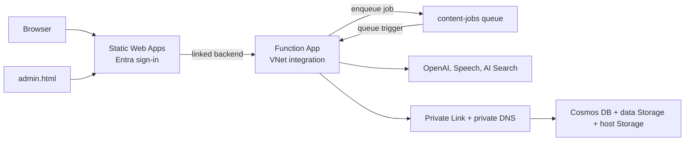

# How It Works: A Deep Dive

> This document explains not just **what** the automation does, but **why** each decision was made—so you can understand, customize, or even rebuild it yourself.

## Table of Contents

1. [The Big Picture](#the-big-picture)
2. [Infrastructure Layer](#infrastructure-layer)
   - [AI Services](#ai-services)
   - [Data Layer](#data-layer)
   - [Web Layer](#web-layer)
3. [Content Pipeline](#content-pipeline)
   - [Discovery](#discovery)
   - [RAG Indexing](#rag-indexing)
   - [Episode Generation](#episode-generation)
4. [Authentication & Security](#authentication--security)
5. [Cost Optimization](#cost-optimization)
6. [Job Orchestration](#job-orchestration)
7. [Deployment](#deployment)
8. [Customization Guide](#customization-guide)

---

## The Big Picture

Here's the thing: this project started from a simple question—*"What if I could turn Microsoft Learn content into podcast episodes for my commute?"*

The answer turned into a fully automated pipeline that:

```
Microsoft Learn → Discovery → RAG Index → AI Narration → Text-to-Speech → Web Player
```

**The core insight**: Microsoft Learn already has great content, but it's designed for reading. We're transforming it into audio, using AI to make it conversational, and serving it through a simple web player.

### Architecture at a Glance



One Function App does everything. It serves the player API, and it runs content
generation in-process off a Storage queue. Because it is VNet integrated, it
reaches Cosmos DB and Storage through Private Endpoints without any additional
compute and without any credential leaving Azure.

GitHub Actions is used for infrastructure and code deployment only. It has no
role in content generation — that is triggered by an admin from the web portal.

See [architecture.svg](diagrams/architecture.svg) for the full topology and
[generation-flow.svg](diagrams/generation-flow.svg) for the job lifecycle.

---

## Infrastructure Layer

All infrastructure is defined in [infra/](../infra/) using Azure Bicep. Here's why we chose each service.

### AI Services

**File**: [`infra/modules/ai-services.bicep`](../infra/modules/ai-services.bicep)

#### Azure OpenAI (`Microsoft.CognitiveServices/accounts`, kind: `OpenAI`)

**What We Deployed**:
- S0 tier OpenAI service
- GPT-4o deployment (`GlobalStandard`, 30K TPM capacity)
- text-embedding-3-large deployment (`Standard`, 10K TPM)

**Why This Configuration**:
```bicep
// Using separate location due to model availability constraints
resource openAi 'Microsoft.CognitiveServices/accounts@2024-04-01-preview' = {
  location: openAiLocation  // Not the same as other resources!
  ...
}
```

Here's the thing about Azure OpenAI: GPT-4o isn't available everywhere. We use `eastus2` because:
- GPT-4o GlobalStandard is available there
- It has good capacity (less rate limiting)
- It's close enough to `centralus` (where other resources live) that latency is fine

**Key Settings You Should Know**:

| Parameter | Value | Why |
|-----------|-------|-----|
| `openAiLocation` | `eastus2` | GPT-4o availability |
| `capacity: 30` | 30K tokens/min | Balances throughput vs. quota |
| `sku: GlobalStandard` | Pay-per-token | Cheaper than provisioned for bursty workloads |

**Tradeoffs**:
- ❌ Could use `gpt-4o-mini` for cheaper narration (faster, ~5x cheaper, but lower quality)
- ❌ Could use provisioned throughput for guaranteed capacity (expensive for occasional use)
- ✅ GlobalStandard is perfect for "generate once, serve forever" workflows

**🎓 Learn More**:
- [Azure OpenAI Model Availability](https://learn.microsoft.com/en-us/azure/ai-services/openai/concepts/models#model-summary-table-and-region-availability)
- [Quotas and limits](https://learn.microsoft.com/en-us/azure/ai-services/openai/quotas-limits)

---

#### Azure AI Foundry (Optional - Study Partner)

**File**: [`infra/modules/ai-foundry.bicep`](../infra/modules/ai-foundry.bicep)

**What We Deployed** (when `enableStudyPartner=true`):
- AIServices account with `allowProjectManagement: true`
- AI Foundry Project (`study-partner`) with System-assigned Managed Identity
- GPT-4o model deployment (`GlobalStandard`, 30K TPM)
- Project connections to CosmosDB, Storage, and AI Search

**Why AI Foundry (not direct OpenAI calls)**:

The Study Partner feature uses AI Foundry's **Agent Service** rather than direct OpenAI API calls. Here's why:

1. **Built-in tool orchestration** - Agents can use tools (like Azure AI Search) natively
2. **Conversation threads** - SDK manages conversation state automatically
3. **Grounding** - Native integration with Azure AI Search for RAG
4. **Enterprise features** - Content filtering, logging, responsible AI controls

**Architecture**:
```
User Query
    │
    ▼
┌───────────────────────────────────────────────────┐
│              Azure Functions                       │
│  POST /api/chat                                   │
│    └─► AIProjectClient (azure-ai-projects SDK)   │
│         └─► agents.create_and_run_agent()        │
└───────────────────────────────────────────────────┘
                    │
                    ▼
┌───────────────────────────────────────────────────┐
│           AI Foundry Project                       │
│  ┌─────────────────────────────────────────────┐  │
│  │              GPT-4o Agent                   │  │
│  │  Instructions: Certification exam prep      │  │
│  │  Model: gpt-4o                              │  │
│  │  Tools: [AzureAISearchTool]                 │  │
│  └─────────────────────────────────────────────┘  │
│                    │                              │
│                    ▼                              │
│  ┌─────────────────────────────────────────────┐  │
│  │         Azure AI Search Tool                │  │
│  │  Index: certification-content               │  │
│  │  Connection: via project connection         │  │
│  └─────────────────────────────────────────────┘  │
└───────────────────────────────────────────────────┘
```

**Key Settings You Should Know**:

| Parameter | Value | Why |
|-----------|-------|-----|
| `foundryLocation` | `swedencentral` | Full AI Foundry feature support |
| `kind: AIServices` | Multi-service | Enables project management |
| `allowProjectManagement` | `true` | Required for Foundry projects |
| `model: gpt-4o` | GlobalStandard | Matches core OpenAI deployment |

**Project Connections**:
The AI Foundry project has connections to existing resources:

| Connection | Resource | Purpose |
|------------|----------|---------|
| CosmosDB | `certaudio-dev-cosmos-*` | Thread storage (agent conversations) |
| Storage | `certaudiodevst*` | File storage (agent attachments) |
| AI Search | `certaudio-dev-search-*` | Vector store for RAG retrieval |

**Tradeoffs**:
- ❌ Adds ~$80/month (primarily AI Search Basic tier)
- ❌ Requires supported region for Foundry (swedencentral)
- ✅ Native tool integration is cleaner than manual RAG orchestration
- ✅ Managed conversation threads simplify state management
- ✅ Enterprise-grade with built-in responsible AI controls

**Implementation Notes**:
- The capability hosts (for agent capabilities) are disabled in Bicep due to Azure preview API issues
- The `azure-ai-projects` SDK can create agents without explicit capability hosts
- Functions app has fallback logic: tries Foundry Agent first, falls back to OpenAI+RAG if unavailable

**🎓 Learn More**:
- [Azure AI Foundry Overview](https://learn.microsoft.com/en-us/azure/ai-studio/what-is-ai-studio)
- [Azure AI Projects SDK](https://learn.microsoft.com/en-us/python/api/overview/azure/ai-projects-readme)
- [Standard Agent Setup](https://learn.microsoft.com/en-us/azure/ai-services/agents/quickstart)

---

#### Azure AI Speech (`Microsoft.CognitiveServices/accounts`, kind: `SpeechServices`)

**What We Deployed**:
- S0 tier Speech service (pay-per-character)
- Neural TTS voices (not the old standard voices)

**Why This Configuration**:
We use neural voices because they sound *dramatically* better than standard voices. The difference between `en-US-Guy` (standard) and `en-US-GuyNeural` is night and day.

**Key Settings You Should Know**:

The voice selection happens at generation time, not deployment time. Pick it in
the admin portal when submitting a job; the defaults come from app settings:

```
INSTRUCTIONAL_VOICE = en-US-Andrew:DragonHDLatestNeural
PODCAST_HOST_VOICE  = en-US-Ava:DragonHDLatestNeural
```

Popular voice choices:
| Voice | Style | Good For |
|-------|-------|----------|
| `en-US-AndrewNeural` | Warm, professional | Instructional (our default) |
| `en-US-GuyNeural` | Newscast, authoritative | Technical content |
| `en-US-AvaNeural` | Engaging, friendly | Conversational |

**Tradeoffs**:
- ❌ HD voices (`-HD` suffix) sound even better but cost 2x more
- ❌ Custom Neural Voice (train your own) is cool but requires audio samples
- ✅ Standard neural voices are the sweet spot for quality vs. cost

**🎓 Learn More**:
- [Voice Gallery (listen to samples!)](https://speech.microsoft.com/portal/voicegallery)
- [SSML Prosody for natural speech](https://learn.microsoft.com/en-us/azure/ai-services/speech-service/speech-synthesis-markup-voice)

---

### Data Layer

**File**: [`infra/modules/data.bicep`](../infra/modules/data.bicep)

#### Azure Cosmos DB (`Microsoft.DocumentDB/databaseAccounts`)

**What We Deployed**:
- Serverless Cosmos DB account (pay-per-RU, no provisioned capacity)
- Three containers: `episodes`, `sources`, `userProgress`
- Partition key: `/certificationId` (episodes, sources) and `/userId` (progress)
- Public network access disabled, with a Cosmos SQL Private Endpoint

**Why Serverless**:
```bicep
capabilities: [
  {
    name: 'EnableServerless'
  }
]
```

Episode metadata is accessed infrequently—users load the episode list once, then stream audio. Serverless is perfect for this "bursty reads, rare writes" pattern. You'd pay ~$25/month minimum for provisioned throughput vs. ~$2/month for serverless with typical usage.

**Why These Partition Keys**:
- `/certificationId` for episodes: All episodes for one cert are in one partition → fast "get all DP-700 episodes" queries
- `/userId` for progress: All progress for one user is in one partition → fast "get my progress" queries

**Tradeoffs**:
- ❌ Provisioned throughput would give consistent performance (overkill for this use case)
- ❌ Could use a single container with composite key (more complex queries)
- ✅ Serverless with simple partitioning is the 80/20 solution

**🎓 Learn More**:
- [Serverless vs Provisioned](https://learn.microsoft.com/en-us/azure/cosmos-db/throughput-serverless)
- [Partition key best practices](https://learn.microsoft.com/en-us/azure/cosmos-db/partitioning-overview#choose-partitionkey)

---

#### Azure Storage Account (`Microsoft.Storage/storageAccounts`)

**What We Deployed**:
- Standard LRS storage (cheapest tier)
- Private access only (`allowBlobPublicAccess: false`)
- No shared key access (`allowSharedKeyAccess: false`)
- Public network access disabled, with private Blob DNS resolution

**Why Private + No Shared Key**:
```bicep
properties: {
  allowBlobPublicAccess: false
  allowSharedKeyAccess: false  // Forces Managed Identity or Azure AD
}
```

This is about security posture. Many enterprise Azure tenants enforce this via policy anyway. By setting it explicitly:
1. Audio files aren't publicly accessible (good—they're behind our API)
2. No connection strings floating around (great—only managed identities can access)

**Blob Organization**:
```
audio/
  └── {certificationId}/
      └── {format}/
          └── episodes/
              ├── 001.mp3
              ├── 002.mp3
              └── ...

scripts/
  └── {certificationId}/
      └── {format}/
          ├── 001.md
          ├── 002.md
          └── ...
```

**Tradeoffs**:
- ❌ Public blob access would be simpler (just give users the URL)—but less secure
- ❌ SAS tokens would work—but they expire and leak
- ✅ Proxying through Functions with Managed Identity is the enterprise-grade approach

**🎓 Learn More**:
- [Storage account security](https://learn.microsoft.com/en-us/azure/storage/common/storage-account-overview#security)
- [Managed Identity for storage](https://learn.microsoft.com/en-us/azure/storage/blobs/authorize-access-azure-active-directory)

---

### Web Layer

**File**: [`infra/modules/web.bicep`](../infra/modules/web.bicep)

#### Azure Static Web Apps

**What We Deployed**:
- Standard tier SWA (supports linked backends)
- Linked to Azure Functions for API

**Why Static Web Apps (not App Service)**:
1. **Free/cheap hosting** for static files (HTML/CSS/JS)
2. **Built-in auth** (Azure AD, GitHub, etc.) if you want it later
3. **Linked backends** let you connect Functions as `/api/*`
4. **Global CDN** included

**Why Standard Tier**:
```bicep
sku: {
  name: 'Standard'  // Not Free!
}
```

We need Standard because:
- Free tier doesn't support linked backends (you'd need SWA's built-in Functions)
- Standard gives you custom domains, more bandwidth, etc.

Cost: ~$9/month. Worth it for the linked backend feature alone.

**🎓 Learn More**:
- [SWA Overview](https://learn.microsoft.com/en-us/azure/static-web-apps/overview)
- [Linked backends](https://learn.microsoft.com/en-us/azure/static-web-apps/functions-bring-your-own)

---

#### Azure Functions

**What We Deployed**:
- Python 3.11 on Linux
- Basic (B1) App Service Plan
- System-assigned Managed Identity

**Why Basic (B1) (not Consumption)**:
```bicep
resource appServicePlan 'Microsoft.Web/serverfarms@2023-12-01' = {
  sku: {
    name: 'B1'
    tier: 'Basic'
  }
}
```

Here's where it gets interesting. Linux Consumption Functions with `allowSharedKeyAccess: false` on storage is... problematic. The deployment mechanism needs storage access, and key-less auth on Consumption has edge cases.

Basic (B1):
- ✅ Works cleanly with Managed Identity storage
- ✅ Always running (no cold starts)
- ✅ Reasonable cost (~$13/month)
- ❌ Doesn't scale to zero (fixed cost)

**If you want to save money**: You could switch to Consumption and enable `allowSharedKeyAccess: true` on the Functions storage account. It's less secure but could save ~$13/month.

**The API Endpoints**:
```
GET  /api/healthz                          # Health check
GET  /api/certifications                   # List available certs
GET  /api/episodes/{certId}/{format}       # Get episode list
GET  /api/audio/{certId}/{format}/{num}    # Stream audio (proxied from blob)
GET  /api/script/{certId}/{format}/{num}   # Get transcript
POST /api/progress/{userId}/{certId}       # Save progress (anonymous)
GET  /api/progress/{userId}/{certId}       # Get progress (anonymous)
GET  /api/me                               # Get authenticated user identity
GET  /api/me/progress/{certId}             # Get progress (authenticated)
POST /api/me/progress/{certId}             # Update progress (authenticated)
```

**🎓 Learn More**:
- [Functions hosting options](https://learn.microsoft.com/en-us/azure/azure-functions/functions-scale)
- [Managed Identity with Functions](https://learn.microsoft.com/en-us/azure/azure-functions/functions-identity-access-azure-sql-with-managed-identity)

---

## Content Pipeline

This is where the magic happens. The pipeline transforms Microsoft Learn content into audio episodes.

### Discovery

**File**: [`src/functions/pipeline/deep_discover.py`](../src/functions/pipeline/deep_discover.py)

**What Happens**:
1. Fetch Microsoft Learn Catalog API
2. **Dynamically resolve** learning paths by filtering on certification role + product tags
3. Get all modules and units from each path
4. Scrape the exam study guide for specific skills (comprehensive mode)
5. **Coverage sweep**: check each exam topic against discovered content with a fallback chain
6. **Confidence score**: compute a weighted coverage percentage (Grade A–F)

**The Two Content Sources**:

| Source | What It Provides | How We Get It |
|--------|------------------|---------------|
| Learn Catalog API | Educational content (modules, units) | REST API call |
| Exam Study Guide | Testable skills (what's on the exam) | HTML scraping |

**Why Both**:
Learning paths teach concepts. Exam skills define what you'll be tested on. They're complementary, not identical. Many exam skills have NO dedicated learning path content.

**Discovery Strategy (Combined)**:

The platform always uses the **combined** strategy: learning paths **plus** the exam study guide skills outline. This provides the most complete coverage and avoids surprising gaps.

**Dynamic Learning Path Resolution**:

Instead of relying on hardcoded learning path UIDs (which go stale when Microsoft renames or restructures content), the platform dynamically discovers paths by filtering the catalog on role + product tags:

```python
# Dynamic: filter by role + product tags (resilient to restructuring)
CERTIFICATION_ROLE_PRODUCTS = {
    "ai-102": {
        "roles": ["ai-engineer"],
        "products": {"azure-ai-services", "azure-ai-search", "azure-openai", ...},
    },
}
# Hardcoded UIDs kept as fallback (stale UIDs auto-detected and skipped)
```

**Coverage Sweep & Confidence Score**:

In comprehensive mode, every exam topic is checked against discovered content with a 3-level fallback chain:
1. **Title match** against learning path module/unit titles
2. **Catalog module description search** for uncovered topics
3. **Learn docs search API** as a last resort
4. **Explicit gap reporting** for truly uncovered topics

The output includes a confidence score (0–100%) with a letter grade:

| Grade | Score | Meaning |
|-------|-------|---------|
| A | ≥ 90% | Excellent — nearly all exam topics have dedicated content |
| B | ≥ 75% | Good — most topics covered, some supplemented from search |
| C | ≥ 60% | Adequate — significant supplementation needed |
| D/F | < 60% | Poor — major content gaps |

**🎓 Learn More**:
- [Microsoft Learn Catalog API](https://learn.microsoft.com/en-us/training/support/catalog-api)
- [Exam study guides](https://learn.microsoft.com/en-us/credentials/certifications/resources/study-guides/dp-700)
- [Content Discovery Details](CONTENT_DISCOVERY.md)

---

### RAG Indexing

**File**: [`src/functions/pipeline/index_content.py`](../src/functions/pipeline/index_content.py)

**What Happens**:
1. Take discovered content (unit text)
2. Chunk it into ~1000-token pieces
3. Generate embeddings for each chunk
4. Upload to Azure AI Search

**Why RAG (Retrieval-Augmented Generation)**:
We don't just dump all the Learn content into the prompt. That would:
- Exceed token limits
- Cost a fortune
- Include irrelevant content

Instead, we index everything, then retrieve only the relevant chunks for each episode topic.

**The Search Index**:
```python
# Index schema (simplified)
fields = [
    SimpleField(name="id", type=SearchFieldDataType.String, key=True),
    SearchableField(name="content", type=SearchFieldDataType.String),
    SearchableField(name="title", type=SearchFieldDataType.String),
    SearchField(
        name="contentVector",
        type=SearchFieldDataType.Collection(SearchFieldDataType.Single),
        vector_search_dimensions=3072,  # text-embedding-3-large
        vector_search_profile_name="default"
    ),
]
```

**Hybrid Search**:
We use both keyword AND vector search:
```python
# In generate_episodes.py
vector_query = VectorizedQuery(
    vector=query_embedding,
    k_nearest_neighbors=10,
)
results = search_client.search(
    search_text=query_text,    # Keyword search
    vector_queries=[vector_query],  # Vector search
    top=5,
)
```

Hybrid search gives you the best of both worlds: exact keyword matches AND semantic similarity.

**🎓 Learn More**:
- [Azure AI Search vector search](https://learn.microsoft.com/en-us/azure/search/vector-search-overview)
- [Hybrid search](https://learn.microsoft.com/en-us/azure/search/hybrid-search-overview)

---

### Episode Generation

**File**: [`src/functions/pipeline/generate_episodes.py`](../src/functions/pipeline/generate_episodes.py)

**What Happens (per episode)**:
1. **Retrieve**: Query AI Search for relevant content
2. **Generate**: GPT-4o creates narration script
3. **Convert**: Transform to SSML (Speech Synthesis Markup)
4. **Synthesize**: Azure Speech creates MP3
5. **Upload**: Store in Blob Storage
6. **Save**: Write metadata to Cosmos DB

**The Narration Prompt** (simplified):
```jinja2
{# From src/functions/pipeline/prompts/narration.jinja2 #}
You are creating an educational audio episode about {{ skill_domain }}.

Topics to cover:

- {{ topic }}


Reference content:
{{ retrieved_content }}

Create a {{ audio_format }} narration that:
- Is approximately 8-10 minutes when spoken
- Explains concepts clearly for someone studying for the exam
- Uses natural, conversational language
```

**SSML Enhancement**:
We don't just send plain text to Speech. We convert to SSML for natural prosody:
```xml
<speak version="1.0" xmlns="http://www.w3.org/2001/10/synthesis">
  <voice name="en-US-AndrewNeural">
    <prosody rate="0.95" pitch="+0Hz">
      Let's talk about data ingestion in Microsoft Fabric.
      <break time="500ms"/>
      There are several approaches you should know...
    </prosody>
  </voice>
</speak>
```

**Batch Processing**:
Episodes are generated in parallel batches:
```yaml
# Workflow creates a matrix of batch indices
batch_size: 10  # Episodes per batch
# 100 episodes → 10 parallel jobs
```

**🎓 Learn More**:
- [SSML reference](https://learn.microsoft.com/en-us/azure/ai-services/speech-service/speech-synthesis-markup)
- [Azure OpenAI prompt engineering](https://learn.microsoft.com/en-us/azure/ai-services/openai/concepts/prompt-engineering)

---

## Authentication & Security

### User Authentication (SWA Built-in Auth)

User sign-in uses **Azure Static Web Apps built-in authentication** with the Microsoft (AAD) provider. This requires zero app registrations, zero infrastructure, and costs nothing—it's included in the Standard SWA tier.

**How It Works**:
```
User clicks "Sign In"
    │
    ▼
/.auth/login/aad  →  Microsoft OAuth  →  /.auth/me (session cookie)
    │
    ▼
SWA injects x-ms-client-principal header on all /api/* requests
    │
    ▼
Functions backend decodes header → stable userId for Cosmos lookups
```

**Key Design Decisions**:

| Decision | Choice | Why |
|----------|--------|-----|
| Auth provider | SWA built-in Microsoft (AAD) | Zero setup, free, any Microsoft account works |
| ~~B2C~~ | Removed | Unnecessary cost and complexity for this use case |
| GitHub/Twitter/Google | Blocked via routes | Only Microsoft provider enabled |
| Progress storage | Cosmos DB `userProgress` container | Already deployed, partitioned by `/userId` |
| Merge strategy | Keep "most complete" state | Handles offline/cross-device conflicts gracefully |

**The `x-ms-client-principal` Header**:
SWA automatically injects this base64-encoded JSON header on requests to the linked Functions backend:
```json
{
  "identityProvider": "aad",
  "userId": "abcdef123456",
  "userDetails": "user@example.com",
  "userRoles": ["authenticated", "anonymous"]
}
```

The `userId` is stable per-provider—same user always gets the same ID, perfect for keying Cosmos documents.

**Progress Sync Flow**:
1. **Anonymous users**: progress saved to `localStorage` only (device-local)
2. **Authenticated users**: progress saved to both `localStorage` (instant) and Cosmos DB (durable)
3. **Sign in on new device**: server progress merges with local, keeping most-complete state per episode
4. **Merge logic**: `completed = server OR local`, `position = max(server, local)`

**Authenticated API Endpoints**:
```
GET  /api/me                              # User identity (from SWA header)
GET  /api/me/progress/{certId}            # Get progress (requires authenticated role)
POST /api/me/progress/{certId}            # Update progress (single or bulk merge)
```

The `/api/me/*` routes require the `authenticated` role in `staticwebapp.config.json`. SWA enforces this before the request reaches Functions.

**Route Configuration** (`staticwebapp.config.json`):
```json
{
  "routes": [
    { "route": "/api/me/*", "allowedRoles": ["authenticated"] },
    { "route": "/.auth/login/github", "statusCode": 404 },
    { "route": "/.auth/login/twitter", "statusCode": 404 },
    { "route": "/.auth/login/google", "statusCode": 404 }
  ]
}
```

**🎓 Learn More**:
- [SWA Built-in Authentication](https://learn.microsoft.com/en-us/azure/static-web-apps/authentication-authorization)
- [SWA Auth Providers](https://learn.microsoft.com/en-us/azure/static-web-apps/authentication-providers)

---

### RBAC (Role-Based Access Control)

We use Azure AD and Managed Identity everywhere. No keys, no connection strings.

**The Principal Types**:
1. **Automation Principal** (GitHub Actions) - deploys infrastructure and code; never touches the private data plane
2. **Functions Managed Identity** - calls AI services and reads/writes private data, both for the player API and for content generation
3. **Users** - authenticate via SWA built-in auth (Microsoft provider)

**Key Role Assignments**:

| Principal | Resource | Role | Why |
|-----------|----------|------|-----|
| Functions MI | OpenAI | Cognitive Services OpenAI User | Call GPT-4o and embeddings |
| Functions MI | Speech | Cognitive Services User | Validate voices and synthesize audio |
| Functions MI | Storage | Storage Blob Data Contributor | Upload episodes, stream audio to users |
| Functions MI | Cosmos | Cosmos DB SQL Data Contributor | Episode metadata, user progress, admins, jobs |
| Functions MI | Search | Search Index Data Contributor | Write the grounding index, query it for RAG |
| Functions MI | Host storage | Blob/Queue/Table Data Contributor | Functions runtime and the content-jobs queue |

There used to be a separate pipeline identity for generation. Now that
generation runs in the Function App there is one identity, and its Storage and
Search roles were raised from Reader to Contributor because it writes what it
used to only read.

**Cosmos DB RBAC Gotcha**:
Cosmos has its OWN RBAC system (not the standard Azure RBAC):
```bicep
// This is NOT Microsoft.Authorization/roleAssignments!
resource cosmosDbSqlDataContributorRole 'Microsoft.DocumentDB/databaseAccounts/sqlRoleAssignments@2024-05-15' = {
  properties: {
    roleDefinitionId: '00000000-0000-0000-0000-000000000002'  // Built-in Data Contributor
    scope: '${cosmosDb.id}/dbs/${cosmosDbDatabaseName}'  // Database-level scope
  }
}
```

**🎓 Learn More**:
- [Azure RBAC overview](https://learn.microsoft.com/en-us/azure/role-based-access-control/overview)
- [Cosmos DB RBAC](https://learn.microsoft.com/en-us/azure/cosmos-db/how-to-setup-rbac)

---

### Deployment Identity

**How It Works**:
`azd` deploys as *you*. There is no service principal, no federated credential,
and no stored secret, because there is no CI/CD system that needs to authenticate
on your behalf.

```bash
az login
azd config set auth.useAzCliAuth true   # azd reuses the az credential
azd up
```

The deploying user needs permission to create resources and assign roles, since
provisioning grants the Function's managed identity its data-plane roles.

**Why not GitHub OIDC**:
An earlier version used a federated credential so GitHub Actions could deploy.
That works, but it makes the project depend on a fork with configured secrets,
and content generation could never run there anyway because the data plane is
private. Removing it means anyone can clone and `azd up` into their own
subscription with nothing to set up first.

Everything the app does at runtime uses its **managed identity**, so no
credential exists to leak in either case.

---

## Cost Optimization

### One Search Index, Shared by Everything

Azure AI Search Basic costs ~$75/month, and an earlier version of this project
tried to dodge that by creating the service at the start of a generation run and
deleting it at the end.

That turned out to be a bad trade. It meant re-indexing every certification from
scratch on every run, a per-certification index that could never be queried
between runs, and orchestration whose only job was managing a resource lifecycle.

Now a single Basic service holds one index, `certification-content`, with a
filterable `certificationId` field. Generation writes to it, Study Partner reads
from it, and refresh runs update only the documents whose source content changed.
Basic allows 15 indexes and far more documents than this workload needs, so one
service covers every certification.

**File**: [`infra/modules/search-persistent.bicep`](../infra/modules/search-persistent.bicep)

---

### Generation Costs No Compute

The Function App runs on a B1 plan with `alwaysOn`, billed at a flat ~$13/month
whether it is idle or generating. Because generation runs in-process on that same
plan, a run adds no compute line item at all — only the OpenAI and Speech tokens
it consumes.

This is why `functionTimeout` is set to `-1` in `host.json`. On a dedicated plan
there is no execution cap, so a multi-hour run is fine.

---

### Monthly Cost Breakdown

| Service | Configuration | Monthly Cost |
|---------|--------------|--------------|
| Cosmos DB | Serverless | ~$2-5 |
| Storage | LRS, ~5GB | ~$0.10 |
| Static Web Apps | Standard | ~$9 |
| Functions | B1 Basic, also runs generation | ~$13 |
| AI Search | Basic, shared index | ~$75 |
| Private Endpoints | Five endpoints | ~$36.50 + data |
| OpenAI | Pay-per-token | ~$0 (no usage) |
| Speech | Pay-per-char | ~$0 (no usage) |
| AI Foundry | Optional Study Partner agent | ~$5-10 |

Subscription-level Microsoft Defender plans are separate from these service estimates.

**Per-Generation Cost**:
| Service | Cost per DP-700 generation |
|---------|---------------------------|
| OpenAI GPT-4o | ~$15-25 |
| OpenAI Embeddings | ~$0.25 |
| Speech TTS | ~$15-18 |
| **Total** | **~$30-43** |

---

## Job Orchestration

### Why Not CI/CD?

Content generation used to run in GitHub Actions. That worked while the data
plane was public, but tenant policy forces `publicNetworkAccess=Disabled` and
`allowSharedKeyAccess=false` on Storage and Cosmos DB, so a GitHub-hosted runner
simply cannot reach them. Every workaround — self-hosted runners, Container Apps
jobs, ACI, App Service WebJobs — was a new piece of compute that existed only to
be inside the VNet.

The Function App was already inside the VNet, already had a managed identity with
the right roles, and was already paid for. So generation moved there.

A useful side effect: once deployed, the app no longer needs the repository. No
workflow dispatch, no OIDC token, no checkout.

### The Flow

```
admin.html → POST /api/admin/jobs → job doc in Cosmos
                                  → message on content-jobs queue
                                  → queue trigger run_content_job
                                  → pipeline/orchestrator.py
                                  → progress written back to the job doc
                                  → admin.html polls GET /api/admin/jobs/{id}
```

**Why a queue and not a direct call?** An HTTP request cannot stay open for
hours. The queue makes the request return immediately with `202` while the work
continues, and it survives an app restart: if the host recycles mid-run, the
message becomes visible again and the job resumes.

`host.json` sets `batchSize: 1` and `newBatchThreshold: 0` so only one job runs
at a time. Generation competes with audio streaming for the same B1 instance, and
the API enforces the same rule up front by returning `409` if a job is already
active.

`maxDequeueCount` is 2. A failed run gets exactly one retry before the message is
dead-lettered, because these runs are expensive and a genuine failure is unlikely
to fix itself.

### Admin Access

The first admin claims access with a one-time bootstrap token, written by Bicep
as the `ADMIN_BOOTSTRAP_TOKEN` app setting and compared with
`hmac.compare_digest`. The claim writes a marker document before writing the
admin record, so a partial failure spends the token rather than leaving it
reusable. After that, admins are managed from the portal and the token is inert.

This avoids hardcoding an email address in the template, which would otherwise
have to be right at deploy time and would be wrong for anyone forking the repo.

### Where the Trust Comes From

`/api/admin/*` reads the caller's identity from the `x-ms-client-principal`
header. That header is only trustworthy because Static Web Apps injects it and
the Function is *not* reachable except through the SWA linked backend. Calling
the Function hostname directly with a hand-crafted header returns `401` before
any application code runs.

This is why the deployment no longer disables EasyAuth on the Function App. An
earlier version did, to make debugging easier — that was the security control,
and turning it off made the header forgeable.

---

## Deployment

### azd up

`azure.yaml` defines the whole deployment: a Bicep template, two services, and a
post-provision hook.

```yaml
infra:
  provider: bicep
  path: infra
  module: main

services:
  api:                        # src/functions -> Azure Functions
  web:                        # src/web -> Static Web Apps
```

**What runs**:
1. `azd provision` deploys `infra/main.bicep` at **subscription scope**, so it
   creates the resource group itself
2. Bicep assigns the Function's managed identity every data-plane role it needs
3. `azd deploy` pushes the Functions code and the site
4. The postprovision hook links the two and enforces authentication

It is idempotent. Run `azd up` as often as you like; it changes only what differs.

**Why subscription scope**: a resource-group-scoped template needs the group to
exist first, which means a manual step before the "one command" deployment. At
subscription scope, `azd up` genuinely is the whole thing.

---

### Why RBAC lives in Bicep

The Function's role assignments used to be a few hundred lines of `az role
assignment create` in a workflow. They are now
[`infra/modules/rbac.bicep`](../infra/modules/rbac.bicep), deployed after the web
module so it can consume `functionsAppPrincipalId`.

Declarative assignments are idempotent by construction: the assignment name is a
deterministic `guid(scope, principalId, roleId)`, so redeploying is a no-op
rather than a "role already exists" error to swallow.

---

### What the postprovision hook does

Two things genuinely cannot be expressed in Bicep, and both are required for the
app to work:

1. **Linking the Static Web App to the Functions backend.** This is what makes
   `/api/*` reachable from the site and what injects `x-ms-client-principal`.
2. **Enforcing EasyAuth on that backend.** Linking registers the Static Web Apps
   identity provider but leaves `requireAuthentication=false`, so the Functions
   hostname still answers anonymous callers and the principal header can be
   forged. Since admin authorization trusts that header, this is a correctness
   requirement, not hardening.

The hook is idempotent, and it verifies rather than assumes: it polls until the
Functions hostname returns `401` and the site's API returns `200`, failing the
deployment if either never happens.

---

### Local Development

Unit tests, the Functions host, the web app, and Azurite all run in the dev
container. Content generation does not: Cosmos DB, Storage, and AI Search are
reachable only from inside the VNet, and opening their firewalls is both against
tenant policy and silently reverted by it.

```bash
cd src/functions
python -m pytest -q
```

The tests cover the SWA principal parsing, the progress endpoints, the ranged
audio proxy, and the admin authorization boundary — including that every
`/api/admin/*` route rejects anonymous callers with `401` and non-admins with
`403`, and that `certificationId` cannot be used to inject into the search
filter.

---

## Customization Guide

### "I want to use a different voice"

Pick it in the admin portal when you submit a job. To change the default for
every job, update the `INSTRUCTIONAL_VOICE` app setting in
[infra/modules/web.bicep](../infra/modules/web.bicep).

[Listen to voice samples](https://speech.microsoft.com/portal/voicegallery)

---

### "I want shorter/longer episodes"

In the workflow, change topics per episode:

```yaml
env:
  TOPICS_PER_EPISODE: 5  # Fewer = shorter episodes
```

Or edit the narration prompt in [`src/functions/pipeline/prompts/narration.jinja2`](../src/functions/pipeline/prompts/narration.jinja2).

---

### "I want to add a new certification"

1. Find the learning path UIDs from [Microsoft Learn Catalog](https://learn.microsoft.com/api/catalog/)
2. Add them to [`src/functions/pipeline/deep_discover.py`](../src/functions/pipeline/deep_discover.py):

```python
CERTIFICATION_PATH_UIDS = {
    # ...existing...
    "your-cert": [
        "learn.wwl.path-uid-1",
        "learn.wwl.path-uid-2",
    ],
}
```

3. Add to the workflow dropdown:
```yaml
certificationId:
  options:
    - your-cert  # Add this
```

---

### "I want to save money on Functions"

Switch to Consumption plan. In [`infra/modules/web.bicep`](../infra/modules/web.bicep):

```bicep
resource appServicePlan 'Microsoft.Web/serverfarms@2023-12-01' = {
  sku: {
    name: 'Y1'        // Changed from B1
    tier: 'Dynamic'   // Changed from Basic
  }
}
```

**Warning**: You'll also need to enable `allowSharedKeyAccess: true` on the Functions storage account.

---

### "I want podcast-style two-voice episodes"

Select `podcast` format in the workflow. It uses two voices with dialogue:

```yaml
audioFormat: 'podcast'
podcastHostVoice: 'en-US-GuyNeural'
podcastExpertVoice: 'en-US-TonyNeural'
```

The narration prompt changes to generate a conversation between host and expert.

---

## Troubleshooting

### "Workflow failed during discovery"

1. Check the study guide URL exists: `https://aka.ms/{CERT-ID}-StudyGuide`
2. If it's a new cert, it might not be in the Catalog API yet
3. Try `skills` mode instead of `comprehensive`

### "Rate limits during generation"

The code has retry logic, but if you're generating multiple certs:
- Reduce `max-parallel` in the matrix
- Increase GPT-4o capacity in Azure Portal

### "Audio sounds robotic"

Make sure you're using Neural voices (names end in `Neural`). The SSML conversion adds prosody, but base voice quality matters.

### "Episodes are too short/long"

Adjust the narration prompt's length guidance, or change `TOPICS_PER_EPISODE`.

---

## What's Next?

Once you understand this system, you could:

1. **Add more content sources** - YouTube transcripts, blog posts, etc.
2. **Implement spaced repetition** - Quiz episodes that revisit old content
3. **Add multi-language support** - Azure Speech supports 100+ languages
4. **Create personalized playlists** - Based on weak areas from practice exams
5. **Add more auth providers** - SWA supports GitHub, Google (requires client ID/secret config)

The foundation is here. Make it yours. 🎧
